[**https://experience.ai.kr/**](https://experience.ai.kr/)
<callout icon="💼" color="blue_bg">
	**대상:** 마케팅·기획·HR·영업·고객성공·운영·교육 등 사무 직무 실무자
	**형태:** 가상 회사 한 곳의 프로젝트 하나를 처음부터 끝까지 따라가는 실습 23개
	**완성 결과물:** 회의록, 일정판과 자동 알림, 사례 비교표, 내 말투로 쓴 기획서, 디자인 시스템과 랜딩페이지·카드뉴스, 초대 메일, 데이터 점검 기록과 그래프, 5장 보고 슬라이드, 재사용 Skill 2개, AI 팀 검토 결과
	**핵심 원칙:** AI는 초안·정리·비교를 돕고, 숫자 확정·외부 발송·최종 승인은 사람이 합니다.
</callout>
## 오늘 따라갈 가상 프로젝트
<callout icon="🧭" color="yellow_bg">
	**가상 회사 '모아워크'의 11월 고객 웨비나**
	모아워크는 회의록·할 일·일정을 한 화면에 모아 주는 업무 협업툴 '모아보드'를 파는 회사입니다. 11월 19일 목요일 오후 2시에 고객 대상 무료 웨비나 'AI로 회의 시간 절반 줄이기'를 엽니다. 여러분은 이 웨비나를 맡은 담당자입니다.
	킥오프 회의 → 일정 관리 → 사례 조사 → 기획서 → 홍보 디자인 → 초대 메일 → 신청자 데이터 분석 → 결과 보고 → 다음 90일 계획까지 한 흐름으로 이어 갑니다.
	회사, 사람, 숫자는 모두 수업을 위해 지어낸 것입니다.
</callout>
웨비나를 고른 이유는 마케팅·영업·고객성공·운영·디자인이 한 프로젝트에 모두 걸려 있기 때문입니다. 내 직무가 달라도 아래처럼 바꿔 읽으면 같은 순서가 그대로 통합니다.
<table fit-page-width="true" header-row="true">
<tr>
<td>내 직무</td>
<td>'웨비나' 대신 이것으로 바꿔 읽기</td>
</tr>
<tr>
<td>HR·교육</td>
<td>신규 입사자 온보딩 프로그램, 사내 교육 과정, 채용 설명회</td>
</tr>
<tr>
<td>영업·고객성공</td>
<td>고객 세미나, 신규 고객 온보딩, 제안 설명회</td>
</tr>
<tr>
<td>기획·운영</td>
<td>사내 제도 도입, 업무 프로세스 개선 프로젝트, 전사 공지</td>
</tr>
<tr>
<td>마케팅</td>
<td>제품 출시 캠페인, 오프라인 행사, 뉴스레터</td>
</tr>
</table>
## 실습 파일
<callout icon="📦" color="yellow_bg">
	아래 파일 12개와 녹음 1개를 한 폴더에 받아 두고 실습 번호 순서대로 쓰면 됩니다. 모두 수업용 가상 자료라서 실제 회사·고객·개인정보가 없습니다.
</callout>
<details>
<summary>실습 파일</summary>
	**03번. 세컨드 브레인에 넣을 회사 자료**
	{{FILE:company_profile}}
	{{FILE:writing_samples}}
	{{FILE:brand_guide}}
	{{FILE:logo}}
	**05번. 회의 녹음과 대본, 회의록 양식**
	{{FILE:audio}}
	{{FILE:script}}
	{{FILE:template}}
	**07번·08번. 웨비나 준비 일정표**
	{{FILE:schedule}}
	**12번. 사례 비교표 양식**
	{{FILE:benchmark}}
	**18번. 신청자 데이터**
	{{FILE:registrants}}
	**22번. 재사용 지시서와 재검증용 데이터**
	{{FILE:skill_research}}
	{{FILE:skill_qc}}
	{{FILE:retest}}
</details>
## 용어 설명
<details>
<summary>업무 용어</summary>
	<table fit-page-width="true" header-row="true">
	<tr>
	<td>말</td>
	<td>쉬운 설명</td>
	</tr>
	<tr>
	<td>웨비나</td>
	<td>인터넷으로 여는 세미나입니다. 신청을 받고 정해진 시간에 온라인으로 발표합니다.</td>
	</tr>
	<tr>
	<td>랜딩페이지</td>
	<td>광고나 메일을 누르면 처음 도착하는 한 장짜리 안내 페이지입니다. 여기서 신청을 받습니다.</td>
	</tr>
	<tr>
	<td>CTA</td>
	<td>Call To Action. '지금 신청하기'처럼 읽는 사람에게 바라는 다음 행동입니다.</td>
	</tr>
	<tr>
	<td>리드</td>
	<td>우리 제품에 관심을 보여 연락할 수 있게 된 잠재 고객입니다.</td>
	</tr>
	<tr>
	<td>참석률</td>
	<td>신청한 사람 중 실제로 들어온 사람의 비율입니다. 무엇을 분모로 삼느냐에 따라 숫자가 달라집니다.</td>
	</tr>
	<tr>
	<td>전환</td>
	<td>관심이 다음 행동으로 이어지는 것입니다. 이 실습에서는 '도입 상담 요청'을 말합니다.</td>
	</tr>
	<tr>
	<td>벤치마크</td>
	<td>다른 회사나 이전 사례를 기준으로 삼아 비교하는 것입니다.</td>
	</tr>
	<tr>
	<td>원자료</td>
	<td>Raw data. 아직 아무것도 고치지 않은 처음 상태의 자료입니다. 이것은 절대 고치지 않고 따로 보관합니다.</td>
	</tr>
	<tr>
	<td>결측값</td>
	<td>있어야 할 자리에 값이 비어 있는 것입니다. 왜 비었는지 확인하기 전에는 아무 값으로도 채우지 않습니다.</td>
	</tr>
	<tr>
	<td>이상치</td>
	<td>다른 값들과 너무 동떨어진 값입니다. 입력 실수일 수도 있고 진짜 값일 수도 있어서 사람이 원본을 봐야 합니다.</td>
	</tr>
	<tr>
	<td>디자인 시스템</td>
	<td>로고, 색, 글꼴, 여백 같은 디자인 규칙을 한 번 정해 두고 모든 결과물에 똑같이 쓰는 기준 묶음입니다.</td>
	</tr>
	<tr>
	<td>톤앤매너</td>
	<td>글과 디자인에서 풍기는 말투와 분위기입니다.</td>
	</tr>
	<tr>
	<td>이해관계자</td>
	<td>프로젝트 결과에 영향을 받거나 결정에 참여하는 사람들입니다.</td>
	</tr>
	</table>
</details>
<details>
<summary>AI 도구 용어</summary>
	<table fit-page-width="true" header-row="true">
	<tr>
	<td>말</td>
	<td>쉬운 설명</td>
	</tr>
	<tr>
	<td>프롬프트</td>
	<td>AI에게 시키는 말입니다. 길게 쓸수록 좋은 것이 아니라 조건을 구체적으로 적을수록 좋습니다.</td>
	</tr>
	<tr>
	<td>환각</td>
	<td>AI가 실제로 없는 자료, 숫자, 문장을 있는 것처럼 지어내는 것입니다. 그럴듯해 보여서 더 위험합니다.</td>
	</tr>
	<tr>
	<td>크레딧</td>
	<td>유료 플랜에서 매달 받는 사용량입니다. 작업을 할 때마다 줄어듭니다.</td>
	</tr>
	<tr>
	<td>무료 할당량</td>
	<td>Free Quota. 유료 플랜에 월간 크레딧과 별도로 붙는 주간 사용량입니다. 표준 모드 작업에 먼저 쓰입니다. 02번에서 자세히 봅니다.</td>
	</tr>
	<tr>
	<td>크레딧 무관 혜택</td>
	<td>크레딧을 쓰지 않는 기본 제공 기능입니다. AI 채팅의 핵심 모델, 기본 화질 AI 이미지, AI 회의록 등이 여기에 들어갑니다.</td>
	</tr>
	<tr>
	<td>표준·Ultra</td>
	<td>작업 모드입니다. 표준(Standard)은 가볍고 무료 할당량으로 돌아가며, Ultra는 품질이 높은 대신 크레딧을 씁니다.</td>
	</tr>
	<tr>
	<td>세컨드 브레인</td>
	<td>내 자료를 모아 두는 개인 지식 공간입니다. 여기에 넣어 두면 다음 작업에서 AI가 그 자료를 참고합니다. 6.0의 중심입니다.</td>
	</tr>
	<tr>
	<td>컨텍스트</td>
	<td>이번 질문에서 AI가 참고할 자료의 범위입니다. 세컨드 브레인에서 파일을 골라 지정합니다.</td>
	</tr>
	<tr>
	<td>Skill</td>
	<td>자주 하는 일의 순서와 결과물 형식을 저장해 둔 지시서입니다. 다음에 새 파일만 넣으면 같은 순서로 다시 해 줍니다.</td>
	</tr>
	<tr>
	<td>디자인</td>
	<td>디자인 시스템을 만들고 그 규칙으로 페이지, 카드뉴스 같은 디자인물을 만드는 에이전트입니다.</td>
	</tr>
	<tr>
	<td>GenTeam</td>
	<td>역할이 다른 여러 AI를 한 방에 불러 서로 검토하게 하는 기능입니다. 사람 동료도 초대할 수 있습니다.</td>
	</tr>
	<tr>
	<td>GenMail</td>
	<td>메일 초안을 쓰는 곳입니다. 'Email Brain'에 내가 메일 쓰는 방식이 정리됩니다.</td>
	</tr>
	<tr>
	<td>워크플로우</td>
	<td>'언제 시작할지'와 '무엇을 할지'를 이어 둔 자동화 흐름입니다.</td>
	</tr>
	<tr>
	<td>MoA</td>
	<td>Mixture-of-Agents. 여러 모델에게 같은 질문을 던지고 답을 모아 하나로 정리하는 방식입니다.</td>
	</tr>
	</table>
</details>
### 모든 실습 프롬프트 앞에 붙이는 공통 안전 문구
```plain text
이 작업은 교육용 가상 자료만 사용한다. 실제 고객 정보, 개인 연락처, 인사 정보, 미공개 재무 정보, 계약서 원문은 입력하지 않는다. 결과는 사람이 검토할 초안이다. 확인할 수 없는 내용은 추정하지 말고 '확인 필요'로 표시한다.
```
<table_of_contents/>
---
## 01. 6.0 한눈에 보기 - 기능이 서로 이어지는 방식 `세컨드 브레인` `AI 채팅`
### 6.0에서 달라진 것
젠스파크는 하나의 도구가 아니라 문서, 표, 슬라이드, 디자인, 이미지, 영상, 회의록, 메일이 한 계정 안에 묶여 있는 형태입니다. Workspace 6.0에서 가장 크게 달라진 점은 이 도구들이 **세컨드 브레인이라는 한 곳을 함께 바라보게 됐다는 것**입니다.
세컨드 브레인에 내 자료를 쌓아 두면 글을 쓸 때도, 슬라이드를 만들 때도, 메일을 쓸 때도, AI 팀원들이 토론할 때도 같은 지식을 꺼내 씁니다. 매번 '우리 회사는 이런 곳이고 나는 이런 일을 한다'고 다시 설명할 필요가 줄어듭니다. 그래서 6.0에서는 '얼마나 많이 모았나'보다 **'쌓인 지식으로 무슨 일을 시키나'**가 중요합니다.
{{IMG:secondbrain-ecosystem.png|내 기록이 세컨드 브레인에 모이고, 그 지식이 글·슬라이드·디자인·메일·AI 팀 업무로 이어지는 구조입니다.}}
### 세컨드 브레인에 자료가 들어오는 길
<table fit-page-width="true" header-row="true">
<tr>
<td>들어오는 길</td>
<td>예시</td>
<td>오늘 실습</td>
</tr>
<tr>
<td>젠스파크에서 나눈 대화와 만든 결과물</td>
<td>회의록, 조사 결과, 기획서, 분석 결과</td>
<td>05, 09, 13, 19</td>
</tr>
<tr>
<td>연결한 메일과 캘린더</td>
<td>받은 메일, 회의 일정</td>
<td>17 (개인 계정만 연결)</td>
</tr>
<tr>
<td>직접 올리는 파일</td>
<td>회사 소개서, 브랜드 가이드, 내가 쓴 글</td>
<td>03</td>
</tr>
<tr>
<td>세컨드브레인 노트</td>
<td>오프라인 미팅이나 떠오른 아이디어를 녹음하는 작은 음성 레코더 기기. 앱에서 정리해 지식으로 쌓습니다.</td>
<td>선택</td>
</tr>
</table>
### 쌓인 지식이 어디로 흘러가나
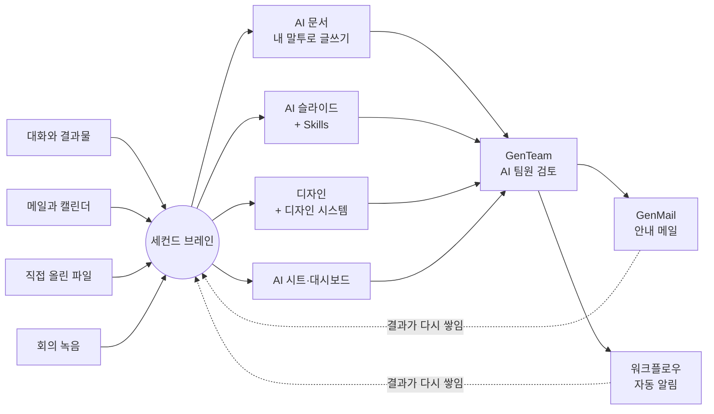
넣기 → 만들기 → 검토하기 → 실행하기의 네 단계이고, 실행한 결과가 다시 세컨드 브레인에 쌓여 다음 일의 출발점이 됩니다.
<table fit-page-width="true" header-row="true">
<tr>
<td>기능</td>
<td>무엇을 하나</td>
<td>세컨드 브레인과 이어지는 방식</td>
<td>오늘 실습</td>
</tr>
<tr>
<td>세컨드 브레인</td>
<td>내 자료 창고</td>
<td>모든 기능의 출발점</td>
<td>03, 04, 06</td>
</tr>
<tr>
<td>AI 회의록</td>
<td>녹음을 회의록으로</td>
<td>정리한 회의록이 쌓이고 다음 회의 때 다시 찾음</td>
<td>05</td>
</tr>
<tr>
<td>대시보드 & CRM</td>
<td>표를 일정판으로</td>
<td>일정표를 판으로 만들고 바뀐 일정으로 알림 문안까지</td>
<td>07, 08</td>
</tr>
<tr>
<td>슈퍼 에이전트·팩트 체크·딥리서치</td>
<td>조사와 검증</td>
<td>검증한 조사 결과를 지식 카드로 저장</td>
<td>09, 10, 11</td>
</tr>
<tr>
<td>AI 시트</td>
<td>표와 데이터</td>
<td>점검·분석 결과 링크를 슬라이드에 그대로 넘김</td>
<td>12, 18, 19, 20</td>
</tr>
<tr>
<td>AI 문서</td>
<td>글쓰기</td>
<td>쌓인 글에서 말투와 사례를 꺼내 씀</td>
<td>13, 14</td>
</tr>
<tr>
<td>디자인</td>
<td>디자인 시스템과 디자인물</td>
<td>브랜드 가이드로 시스템을 한 번 만들고 계속 재사용</td>
<td>15, 16</td>
</tr>
<tr>
<td>GenMail</td>
<td>메일 초안</td>
<td>Email Brain의 내 말투 + 세컨드 브레인 자료로 메일 작성</td>
<td>17</td>
</tr>
<tr>
<td>AI 슬라이드 + Skills</td>
<td>발표자료와 반복 지시서</td>
<td>세컨드 브레인 자료를 스스로 찾아 슬라이드로, Skill로 형식 고정</td>
<td>21, 22</td>
</tr>
<tr>
<td>GenTeam</td>
<td>AI 팀원 토론</td>
<td>세컨드 브레인 지식을 두고 여러 역할이 서로 따짐</td>
<td>23</td>
</tr>
<tr>
<td>워크플로우</td>
<td>자동화</td>
<td>반복되는 알림과 기록을 정해진 때에 자동으로</td>
<td>08</td>
</tr>
</table>
<callout icon="💡" color="gray_bg">
	이 표의 순서가 오늘 실습 순서입니다. 앞에서 넣어 둔 것이 많을수록 뒤 작업의 프롬프트가 짧아집니다. 23번에 도착하면 '세컨드 브레인의 모아워크 자료로'라는 한 마디로 AI 팀이 토론을 시작합니다.
</callout>
### 첫 질문 · AI 채팅과 여러 모델 한 번에 쓰기
AI 채팅은 젠스파크에서 가장 가벼운 화면입니다. 파일을 만들지 않고 묻고 답하기만 합니다. 간단한 질문을 슈퍼 에이전트에서 하면 할당량이나 크레딧이 나가지만, AI 채팅의 **핵심 모델**로 하면 크레딧과 무관한 몫에서 처리됩니다.
여기에는 한 가지 더 있습니다. 모델을 하나만 고르는 대신 **여러 모델에게 같은 질문을 동시에 던지고 답을 모아 보는 방식**을 고를 수 있습니다. 화면에는 `Mixture-of-Agents` 라고 적혀 있습니다. 줄여서 MoA라고 부릅니다.
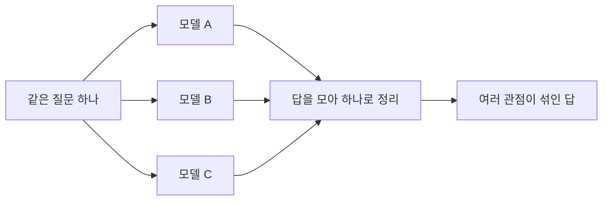
한쪽 모델만 아는 것을 다른 쪽이 채워 주기 때문에, 처음 방향을 잡을 때나 빠진 것이 없는지 볼 때 쓸 만합니다. 대신 여러 모델을 함께 돌리는 셈이라 한 모델만 쓸 때보다 소모가 큽니다.
**1단계. AI 채팅을 열고 모델 목록을 봅니다.**
왼쪽 메뉴에서 AI 채팅으로 들어갑니다. 입력창 아래에 지금 쓰는 모델 이름이 적혀 있습니다. 눌러서 목록을 엽니다.
{{IMG:n-01-01-chat-entry.png|맨 위에 Mixture-of-Agents가 있고 그 아래로 개별 모델이 늘어섭니다. 모델마다 1x, 2x, 5x, 30x 같은 배수가 붙어 있습니다. 같은 질문이라도 어떤 모델을 고르냐에 따라 소모가 서른 배까지 차이 난다는 뜻입니다. 9월 18일 개편 이후에는 '크레딧 무관'과 '크레딧' 표시도 함께 붙으니 지금 화면에서 어느 모델에 어떤 표시가 있는지 찾아보십시오.}}
**2단계. Mixture-of-Agents를 고르고 질문을 붙여 넣습니다.**
```plain text
나는 B2B 소프트웨어 회사의 마케팅 담당자다. 11월에 고객 대상 무료 웨비나를 처음 연다. 기획부터 끝난 뒤 결과 보고까지 무엇을 순서대로 정해야 하는지 6단계로 알려줘. 각 단계마다 누가 결정해야 하는지, 그 단계에서 어떤 결과물이 나오는지도 함께 적어줘.
```
**3단계. 모아진 답을 봅니다.**
결과의 꺾쇠를 열면 모델별 답과, 그 답들을 어떻게 평가해서 하나로 합쳤는지가 보입니다. 나온 6단계를 위 표의 오늘 실습 순서와 나란히 놓고 비교해 보십시오. 다만 이 답은 우리 회사 사정을 모르고 쓴 것이므로, 결정 주체는 사람이 우리 조직에 맞게 고쳐야 합니다.
---
## 02. 크레딧제 변화와 무료 할당량 `크레딧 사용량` `슈퍼 에이전트`
### 2026년 9월 18일에 무엇이 바뀌었나
젠스파크 유료 플랜은 매달 크레딧을 받고(Plus는 월 10,000, Pro는 월 125,000 크레딧부터), 작업을 시킬 때마다 크레딧이 줄어듭니다. 9월 18일 요금 구조가 바뀌면서 **크레딧과 별도로 매주 채워지는 '무료 할당량'**이 생겼고, 그동안 무제한이던 AI 채팅·AI 이미지는 **'핵심 모델은 포함, 플래그십 모델은 크레딧'** 구조로 바뀌고 있습니다.
<table fit-page-width="true" header-row="true">
<colgroup>
<col width="140">
<col>
<col>
</colgroup>
<tr>
<td>항목</td>
<td>지금 규칙</td>
<td>실습에서 챙길 점</td>
</tr>
<tr>
<td>무료 할당량 (신규)</td>
<td>월간 크레딧과 별도인 주간 사용량. 표준 모드 작업에 먼저 쓰입니다. Pro는 Plus의 10배입니다.</td>
<td>오늘 실습은 전부 표준 모드로 합니다</td>
</tr>
<tr>
<td>AI 채팅</td>
<td>핵심 모델(Claude Sonnet처럼 '크레딧 무관' 표시)은 포함. 플래그십 모델(Claude Opus처럼 '크레딧' 표시)은 크레딧을 씁니다.</td>
<td>가벼운 질문은 핵심 모델로</td>
</tr>
<tr>
<td>AI 이미지</td>
<td>기본 화질 GPT Image 등 '크레딧 무관' 표시 모델은 포함. 고화질·큰 크기 옵션과 플래그십 이미지 모델은 크레딧을 씁니다.</td>
<td>초안은 기본 화질, 최종 한 장만 고화질</td>
</tr>
<tr>
<td>AI 회의록</td>
<td>하루 24시간까지 크레딧 무관</td>
<td>05번 실습은 부담 없이</td>
</tr>
<tr>
<td>Speakly</td>
<td>음성 받아쓰기는 크레딧 무관</td>
<td>긴 프롬프트는 말로 입력</td>
</tr>
<tr>
<td>Ultra 모드, 영상, 오디오</td>
<td>무료 할당량 밖. 크레딧을 씁니다.</td>
<td>꼭 필요할 때만</td>
</tr>
</table>
<callout icon="📅" color="blue_bg">
	**언제 구독했느냐에 따라 화면이 다를 수 있습니다**
	- **9월 18일 전부터 구독한 사람:** 지금까지의 AI 채팅·이미지 무제한 혜택이 **2026년 12월 31일까지** 그대로 유지되고, 무료 할당량이 새로 더해집니다.
	- **그 뒤에 구독한 사람:** 처음부터 '핵심 모델 포함, 플래그십 모델 크레딧' 구조로 씁니다.
	- **2027년 1월 1일부터:** 모든 멤버가 같은 구조가 됩니다. 핵심 모델도 사용 한도에 닿으면 월간 크레딧으로 이어서 씁니다.
	그래서 옆 사람과 같은 모델을 골라도 한 사람은 크레딧이 안 나가고 다른 사람은 나갈 수 있습니다. 수업 중에 크레딧 표시가 다르면 이 차이 때문입니다.
</callout>
### 무료 할당량(Free Quota) 제대로 알기
<callout icon="🎁" color="green_bg">
	**무료 할당량이 적용되는 곳**
	표준 모드로 실행하는 슈퍼 에이전트, AI 슬라이드, AI 시트, AI 문서, 딥리서치, 팩트 체크, 세컨드 브레인입니다. 텍스트 작업과 이미지 작업이 여기 들어가고, 영상·오디오 에이전트의 기획 단계도 포함됩니다.
	**적용되지 않는 곳**
	Ultra 모드, 실제 영상과 오디오 생성은 무료 할당량이 아니라 크레딧을 씁니다.
</callout>
- **주기:** 그 주기의 첫 메시지를 보낸 때부터 7일입니다. 7일 뒤에 다시 채워지고, 남은 양은 다음 주로 넘어가지 않습니다.
- **다 쓰면:** 작업이 멈추지 않고 자동으로 월간 크레딧으로 넘어가 계속 돌아갑니다. 다음 초기화 때 다시 무료 할당량부터 씁니다. 모르는 사이에 크레딧이 나갈 수 있다는 뜻이기도 합니다.
- **확인:** 왼쪽 아래 프로필 메뉴에 현재 크레딧과 남은 무료 할당량이 나오고, 자세한 내역은 사용량 화면에서 봅니다.
**1단계. 입력창 아래의 모드 선택 메뉴를 엽니다.**
{{IMG:n-quota-03-mode-menu.png|입력창 왼쪽 아래 번개 모양 옆이 모드 메뉴입니다. 표준에는 '무료 할당량 사용' 표시가 붙어 있고, Ultra에는 '일반적으로 100\~600 크레딧/메시지'라고 적혀 있습니다. 이 한 화면이 오늘 실습에서 가장 중요합니다.}}
**2단계. 표준 모드가 선택된 상태로 둡니다.**
{{IMG:n-quota-04-standard.png|표준이 선택된 입력창입니다. 오늘은 이 상태로 두고 실습합니다.}}
**3단계. 무료 할당량이 얼마나 남았는지 봅니다.**
왼쪽 아래 계정 메뉴에서 사용량 화면으로 들어갑니다.
{{IMG:n-quota-02-usage.png|'무료 할당량 28% 남음, 이번 주 72% 사용, 5일 11시간 후 초기화'처럼 나옵니다. 주 단위로 다시 채워지므로 많이 만들어 볼 일이 있으면 주기 초반에 몰아서 하는 편이 낫습니다. 오른쪽 '크레딧 무관 혜택'에는 크레딧과 별개로 쓸 수 있는 AI 채팅, AI 이미지, AI 회의록 사용량이 나옵니다.}}
실습 시작 전에 이 화면의 숫자를 적어 두십시오. 오늘 실습이 끝나고 다시 열어 비교하면 어떤 작업이 많이 쓰는지 몸으로 알게 됩니다.
### 크레딧이 많이 드는 작업
같은 일을 시켜도 아래 일곱 가지에 따라 소모량이 갈립니다. 왼쪽 칸에 머무는 습관을 들이면 됩니다.
<table fit-page-width="true" header-row="true">
<colgroup>
<col width="140">
<col color="green_bg">
<col color="red_bg">
</colgroup>
<tr>
<td>무엇이</td>
<td>적게 드는 쪽</td>
<td>많이 드는 쪽</td>
</tr>
<tr>
<td>모드</td>
<td>표준(Standard), 무료 할당량</td>
<td>Ultra</td>
</tr>
<tr>
<td>AI 채팅 모델</td>
<td>'크레딧 무관' 핵심 모델</td>
<td>'크레딧' 플래그십 모델, 30x 추론 모델</td>
</tr>
<tr>
<td>글 길이</td>
<td>짧게 묻고 짧게 받기</td>
<td>긴 자료를 통째로 넣고 여러 번 주고받기</td>
</tr>
<tr>
<td>이미지 화질</td>
<td>기본 화질</td>
<td>고화질, 큰 크기, 4K</td>
</tr>
<tr>
<td>영상·오디오</td>
<td>기획 단계까지만</td>
<td>8초에서 16초 이상 영상, 긴 내레이션</td>
</tr>
<tr>
<td>한 번에 받는 개수</td>
<td>한 가지만</td>
<td>여러 모델에게 동시에 시켜 여러 개 받기</td>
</tr>
<tr>
<td>일의 덩치</td>
<td>질문 하나에 답 하나</td>
<td>찾기와 쓰기와 그림까지 한 번에 시키기</td>
</tr>
</table>
### 크레딧이 자꾸 새는 현상
<table fit-page-width="true" header-row="true">
<colgroup>
<col width="150">
<col>
<col>
</colgroup>
<tr>
<td>어디서</td>
<td>무슨 일이 일어나나</td>
<td>대신 이렇게</td>
</tr>
<tr>
<td>다시 만들기</td>
<td>다시 시킬 때마다 처음 만들 때와 똑같이 듭니다. 세 번 다시 만들면 세 배입니다.</td>
<td>지시문을 다듬어 다시 시키거나, 작은 부분은 손으로 고칩니다</td>
</tr>
<tr>
<td>실패한 재시도</td>
<td>실패해도 시도한 만큼 나갑니다.</td>
<td>시작 전에 파일을 다 붙이고 범위를 정해 줍니다. 같은 데서 두 번 막히면 멈추고 입력을 고칩니다</td>
</tr>
<tr>
<td>길어진 대화</td>
<td>한 마디 보낼 때마다 앞의 대화를 통째로 다시 읽습니다. 대화가 길수록 한 마디 값이 커집니다.</td>
<td>작은 수정은 편집 화면에서 직접 합니다. 주제가 바뀌면 새 대화를 엽니다</td>
</tr>
<tr>
<td>고치기 대신 새로 만들기</td>
<td>다 만든 문서를 조금 고치려고 처음부터 다시 만드는 경우입니다.</td>
<td>고칠 곳만 지정합니다. 부분 수정은 새로 만들기보다 훨씬 적게 듭니다</td>
</tr>
<tr>
<td>할당량이 끝난 줄 모름</td>
<td>무료 할당량을 다 쓰면 알림 없이 크레딧으로 넘어갑니다.</td>
<td>큰 작업 전에 프로필 메뉴에서 남은 할당량을 먼저 봅니다</td>
</tr>
</table>
### 표준과 Ultra, 어느 쪽을 고를까
모델 이름을 외울 필요는 없습니다. 이 결과물이 어디까지 나가는지만 생각하면 됩니다.
<table fit-page-width="true" header-row="true">
<tr>
<td>표준(Standard)으로 충분한 때</td>
<td>Ultra를 쓸 만한 때</td>
</tr>
<tr>
<td>매일 쓰는 일, 적당한 수준이면 되는 일</td>
<td>결과물이 팀 밖으로 나가거나 여러 사람이 보는 일</td>
</tr>
<tr>
<td>초안 단계</td>
<td>초안이 아니라 마지막 판을 만들 때</td>
</tr>
<tr>
<td>팀 공유용 초안, 회의록 정리, 발표자료 뼈대 잡기, 데이터 점검</td>
<td>고객에게 보내는 제안서 최종본, 경영진 보고 최종 슬라이드, 광고에 실제로 쓸 이미지</td>
</tr>
</table>
<callout icon="⚠️" color="yellow_bg">
	Ultra로 초안부터 만들면 고칠 때마다 비싼 값이 나갑니다. 표준으로 형태를 확정하고, 마지막에 한 번만 Ultra로 퀄리티를 올립니다.
</callout>
---
## 03. 내 업무 맥락 세컨드 브레인에 넣기 `세컨드 브레인`
### 이 기능은 무엇인가 · 세컨드 브레인
내 자료를 모아 두는 곳입니다. 여기에 올려 둔 문서, 표, 회의록은 다음 작업에서 AI가 근거로 참고합니다. 몇 달 전 자료를 검색해 다시 꺼내 쓸 수도 있습니다.
쓸 때 가장 중요한 것은 **무엇을 넣을지**와 **답의 범위를 어디까지로 묶을지**입니다. 한번 넣은 자료는 이후 여러 작업에서 계속 쓰이므로, 넣기 전에 먼저 판단합니다.
<table fit-page-width="true" header-row="true">
<colgroup>
<col color="green_bg">
<col color="yellow_bg">
<col color="red_bg">
</colgroup>
<tr>
<td>올려도 되는 것</td>
<td>담당 부서에 확인한 뒤</td>
<td>올리면 안 되는 것</td>
</tr>
<tr>
<td>공개된 회사 소개, 보도자료, 홈페이지 글, 내가 쓴 공개 글, 빈 양식, 수업용 가상 자료</td>
<td>사내 교육 자료, 민감한 내용이 없는 내부 회의록, 사내 브랜드 가이드</td>
<td>고객 개인정보와 연락처, 인사평가·급여, 미공개 재무·매출, 계약서 원문, 계정 비밀번호·API 키</td>
</tr>
</table>
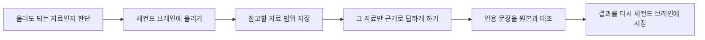
**이번에 올리는 파일**
세 개를 올립니다. 위 표의 '올려도 되는 것'에 해당하는지 하나씩 따져 보면서 올리십시오.
- `company_profile.md` 가상 회사 모아워크의 소개서입니다. 제품, 고객, 지난 웨비나 기록이 있습니다.
- `writing_samples.md` 담당자가 쓴 뉴스레터 글과 링크드인 글입니다. 13번에서 AI가 이 말투를 따라 씁니다.
- `brand_guide.md` 색상, 글꼴, 말투 규칙입니다. 15번에서 디자인 시스템의 재료가 됩니다.
**1단계. 세컨드 브레인을 열고 업로드 버튼을 찾습니다.**
왼쪽 메뉴에서 세컨드 브레인을 누릅니다.
{{IMG:n-06-01-upload-button.png|가운데 입력창 아래에 '내 문서' 목록이 있고, 그 오른쪽 위에 '업로드' 버튼이 있습니다. 새 문서를 직접 쓰는 대신 가지고 있는 파일을 그대로 올릴 수 있습니다.}}
**2단계. 실습 파일 세 개를 올립니다.**
`company_profile.md`, `writing_samples.md`, `brand_guide.md`를 고릅니다. 올리는 동안 진행 표시가 나옵니다.
**3단계. 목록에 세 파일이 들어왔는지 봅니다.**
내 문서 목록에 세 파일이 보이면 자료를 AI에게 건네준 상태입니다.
**4단계. 이 세 파일만 참고하도록 범위를 좁힙니다.**
입력창의 '컨텍스트' 메뉴에서 방금 올린 세 파일만 선택합니다. 선택된 자료가 세 개인지 눈으로 확인합니다. 이 범위 지정이 다음 실습의 출발점입니다.
<callout icon="🔐" color="gray_bg">
	세컨드 브레인 설정에서 메일과 캘린더를 연결하면 그 내역도 자료로 들어옵니다. 연결은 **개인 계정으로만** 하십시오. 회사 메일함은 고객 정보가 오가는 통로이므로 보안 담당의 승인 없이 연결하지 않습니다.
</callout>
---
## 04. 넣은 자료만 보고 업무 맥락 브리프 만들기 `세컨드 브레인`
AI는 모르는 것도 아는 것처럼 대답합니다. 그래서 답의 범위를 자료 안으로 묶어 두는 방법을 먼저 배웁니다. 여기서 만드는 '업무 맥락 브리프'는 오늘 뒤의 모든 실습에서 공통 배경으로 씁니다.
**1단계. '컨텍스트'로 세 파일만 선택한 상태에서 질문합니다.**
```plain text
지금 선택한 세 파일의 내용만 사용해서 '모아워크 웨비나 담당자 업무 맥락 브리프'를 1쪽으로 만들어줘.
1. 회사와 제품을 한 문단으로
2. 우리 고객은 누구이고 무엇을 불편해하는지
3. 지난 웨비나 기록에서 알 수 있는 것
4. 이 담당자가 쓰는 문체와 피해야 할 표현
5. 파일만으로는 알 수 없어서 확인이 필요한 항목

파일에 없는 내용은 절대 추가하지 말고, 파일만으로 알 수 없는 것은 '확인 필요'라고 적어줘. 각 항목마다 근거가 된 문장을 파일에서 그대로 인용해줘.
```
'선택한 파일의 내용만'과 '없는 내용은 추가하지 마라'를 함께 넣는 것이 핵심입니다. 이 두 마디가 없으면 AI는 일반 지식을 섞어서 답합니다.
**2단계. 답이 세 파일 안에서만 나왔는지 봅니다.**
- 지난 웨비나 숫자가 파일과 같이 '신청 212명, 참석 81명'으로 나왔는지 봅니다.
- 파일에 없는 목표 참석률, 고객사 이름, 매출이 새로 생겼다면 그것이 환각입니다.
- 브랜드 가이드의 금지 표현('업계 최초', '무조건', '100%')이 '피해야 할 표현'에 들어갔는지 봅니다.
**3단계. 틀린 곳을 직접 고치고 세컨드 브레인에 저장합니다.**
잘못 추론한 항목은 사람이 고친 다음, `모아워크_업무맥락브리프_2026-10` 이라는 이름으로 세컨드 브레인에 저장합니다. 이름에 과제명과 날짜를 넣어 두면 나중에 검색할 때 바로 나옵니다.
---
## 05. 킥오프 회의 녹음을 회의록으로 `AI 회의록`
### 이 기능은 무엇인가 · AI 회의록
녹음 파일을 올리면 말을 글로 옮겨 주고, 그 글에서 결정된 것과 할 일을 뽑아 정리해 주는 기능입니다. 회의 중에 바로 녹음할 수도 있고, 이미 가지고 있는 녹음 파일을 올릴 수도 있습니다. 하루 24시간까지 크레딧과 무관하게 쓸 수 있습니다.
실제 회의를 녹음하려면 참석자에게 먼저 알리고 동의를 받아야 합니다. 고객이나 인사 정보가 오가는 회의는 회사 규정부터 확인합니다. 그래서 오늘은 수업용으로 만든 가상 회의 녹음만 씁니다. 사무실 밖 미팅은 세컨드브레인 노트 기기로 녹음해 같은 방식으로 정리할 수 있습니다.
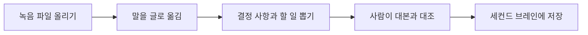
**이번에 쓰는 파일**
- `webinar_kickoff_meeting_audio.m4a` 마케팅 리드, 영업 매니저, 고객성공 매니저, 디자이너가 참석한 2분 30초짜리 가상 킥오프 회의입니다. 합성 음성입니다.
- `webinar_kickoff_meeting_script.txt` 녹음 대본입니다. AI가 옮긴 글이 맞는지 이 대본과 맞춰 봅니다.
- `meeting_notes_template.md` 결정, 근거, 미정, 실행 항목으로 나뉜 회의록 양식입니다. '미정'을 따로 두는 것이 핵심입니다. 결론이 안 난 것을 난 것처럼 적으면 다음 회의에서 다시 싸웁니다.
**1단계. AI 회의록 화면을 엽니다.**
{{IMG:r-07-02-meeting-entry.png|왼쪽 메뉴에서 AI 회의록을 누릅니다. 회의 중에 바로 녹음하는 방법과 녹음 파일을 올리는 방법이 있습니다. 오늘은 수업용 파일을 올리는 방법을 익힙니다.}}
**2단계. 오디오 가져오기를 눌러 녹음 파일을 올립니다.**
내려받아 둔 `webinar_kickoff_meeting_audio.m4a`를 선택합니다.
**3단계. 글로 옮기는 동안 기다리고, 옮겨진 글을 확인합니다.**
말한 사람이 구분되어 나오는지, 사람 이름 대신 역할로 표시되는지 봅니다.
**4단계. 잘못 옮겨진 부분을 찾습니다.**
제품 이름과 숫자, 날짜가 가장 자주 틀립니다. 원래 대본과 나란히 놓고 아래를 하나씩 확인합니다. 고치기 전에 무엇이 틀렸는지 먼저 표시해 둡니다.
- 숫자: 212명, 81명, 300명, 120명, 48시간
- 날짜: 10월 9일, 10월 17일, 11월 12일, 11월 19일, 10월 13일
- 이름: 모아워크, 모아보드
**5단계. 옮겨진 회의 기록을 놓고 아래 프롬프트를 넣습니다.**
```plain text
위 회의 기록을 아래 다섯 부분으로 나눠서 정리해줘.
1. 결정된 것
2. 원문에서 확인된 근거. 결정마다 회의에서 실제로 나온 문장을 그대로 인용
3. 아직 정하지 않은 것. 왜 안 정했는지와 누가 언제 정하는지
4. 실행 항목. 업무, 담당 역할, 기한, 무엇이 되면 끝난 것으로 볼지를 표로
5. 다음 회의 안건

사람 이름은 쓰지 말고 역할로만 적어라. 회의에서 나오지 않은 내용은 절대 추가하지 마라. 담당이나 기한이 회의에서 정해지지 않았으면 비워 두고 '확인 필요'라고 적어라.
```
**6단계. 결정과 미정이 제대로 나뉘었는지 봅니다.**
이 회의에는 일부러 헷갈리는 대목을 넣어 두었습니다.
- '신청 300명, 참석 120명'은 목표로 말했지만 **예산 확정 후 다시 보기로 한 미정 사항**입니다. 결정된 것에 들어가 있으면 틀린 것입니다.
- 리마인드 문자는 **보류**, 경품은 **법무팀 확인 후 결정**입니다.
- 문자 수신 동의 확인은 운영 담당에게 맡겼지만 기한을 정하지 않았습니다. 기한 칸이 '확인 필요'로 남아 있어야 맞습니다.
**7단계. 회의록을 세컨드 브레인에 저장합니다.**
`2026-10-06_11월웨비나_킥오프회의록` 처럼 날짜, 과제명, 회의 종류를 제목에 넣어 저장합니다. 첫 줄에는 '녹음 원본은 정리 후 삭제'라고 적어 둡니다.
---
## 06. 지난 회의를 다시 찾아 다음 안건 만들기 `세컨드 브레인`
회의록을 만들어 두고 다시 찾아 쓰지 않으면 쌓아 둔 의미가 없습니다. 프로젝트는 몇 주에 걸쳐 진행되기 때문에 지난 회의에서 무엇을 미뤘는지 기억하기 어렵습니다. 저장한 기록을 다시 꺼내 쓰는 방법을 익힙니다.
**1단계. 세컨드 브레인의 검색창을 엽니다.**
세컨드 브레인 화면 위쪽의 돋보기 모양을 눌러 검색창을 엽니다. 저장된 자료가 많아질수록 목록을 훑는 것보다 검색이 빠릅니다.
**2단계. 과제와 관련된 말로 검색합니다.**
'웨비나'처럼 과제명으로 찾습니다. 제목에 과제명을 적어 두었다면 05번 회의록이 바로 나옵니다. 찾은 회의록을 컨텍스트로 선택합니다.
**3단계. 아직 안 끝난 것만 뽑아 다음 회의 안건을 만듭니다.**
```plain text
선택한 지난 회의 기록에서 아직 결론이 나지 않은 항목만 뽑아 10월 13일 회의 안건 초안을 만들어줘. 각 안건 옆에 근거가 된 문장을 그대로 인용하고, 왜 아직 안 끝났는지와 이번 회의에서 무엇을 정해야 하는지를 한 줄씩 적어줘. 근거를 찾지 못한 항목은 만들지 말고 '확인 필요'로 표시해줘. 회의에서 나오지 않은 새로운 안건은 추가하지 마라.
```
'회의에서 나오지 않은 새로운 안건은 추가하지 마라'를 빼면 AI가 그럴듯한 안건을 스스로 만들어 냅니다.
**4단계. 만들어진 안건을 확인합니다.**
목표 인원, 문자 수신 동의, 경품 세 가지가 근거 문장과 함께 나왔는지 봅니다. 여기에 없던 안건이 섞여 있으면 지웁니다.
---
## 07. 일정표를 한눈에 보이는 일정판으로 `대시보드 & CRM`
### 이 기능은 무엇인가 · 대시보드 & CRM
표로 된 파일을 올리면 그 안의 값을 읽어 보기 좋은 판으로 만들어 주는 기능입니다. 이름에 CRM이 붙어 있지만 고객 관리 전용은 아니고, 항목과 날짜와 담당이 들어 있는 표라면 무엇이든 올릴 수 있습니다. 프로젝트 일정표, 채용 진행 현황, 영업 파이프라인 같은 것이 여기에 해당합니다.
한 번 판을 만들어 두면 그 뒤에는 말로 조건을 바꿔 가며 다시 볼 수 있습니다. '디자인 시안이 일주일 밀리면 어떻게 되는지'처럼 가정을 바꿔 보는 일이 표에서는 손이 많이 가는데 여기서는 한 문장이면 됩니다.
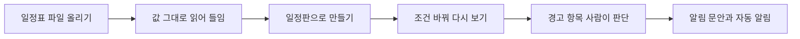
**이번에 쓰는 파일**
`webinar_schedule.csv` 업무 여덟 개짜리 웨비나 준비 일정표입니다. `dependency` 칸에 앞 업무 번호가 적혀 있어서 순서가 정해져 있습니다. `fixed_date`가 Y인 T07 웨비나 당일은 날짜를 옮길 수 없는 업무입니다.
**1단계. 대시보드 & CRM 화면을 엽니다.**
왼쪽 메뉴에서 찾습니다. 안 보이면 `더보기`를 눌러 전체 목록에서 고릅니다.
{{IMG:n-04-01-entry.png|왼쪽에 자료를 가져오는 네 가지 방법이 있습니다. 오늘은 '파일에서 가져오기'를 씁니다. 오른쪽 '모든 템플릿' 탭에는 업무 종류별로 미리 만들어진 형태들이 있습니다.}}
**2단계. 일정 파일을 올리고 원본을 확인합니다.**
파일에서 가져오기를 눌러 `webinar_schedule.csv`를 선택합니다. 업무, 담당 역할, 시작일, 마감일, 선행 업무, 완료 기준, 승인자, 고정 날짜 여부가 그대로 들어왔는지 봅니다. 여기서 빠진 칸이 있으면 뒤에서 계속 문제가 됩니다.
**3단계. 일정판으로 만들어 달라고 요청합니다.**
```plain text
올린 일정표로 웨비나 준비 일정판을 만들어줘. 업무마다 담당 역할, 시작일, 마감일, 상태, 선행 업무를 표시하고, 앞 업무가 끝나야 시작할 수 있는 업무는 화살표로 연결해서 보여줘. fixed_date가 Y인 업무는 날짜를 옮길 수 없는 업무로 눈에 띄게 표시하고, 마감이 겹치는 업무가 있으면 따로 표시해줘.
```
판 위쪽에 업무 수와 완료 수가 나오고, 가운데에 T01 → T03 → T04, T01 → T02 → T05 → T06 → T07 → T08 처럼 화살표로 이어진 업무 체인이 보이면 됩니다. 표에서는 `dependency` 칸의 숫자였던 것이 여기서는 순서로 보입니다.
---
## 08. 밀린 일정 반영하고 알림 문안·자동 알림 만들기 `대시보드 & CRM` `워크플로우`
실제 프로젝트는 예정대로 가지 않습니다. 시안이 늦어지거나 승인이 밀리면 뒤 일정이 줄줄이 움직입니다. 07번에서 만든 일정판에 이어서 합니다.
**1단계. 디자인 시안이 7일 늦어졌다고 가정하고 조정을 요청합니다.**
```plain text
T03 랜딩페이지·카드뉴스 시안이 7일 늦어지는 상황으로 가정해줘. T03의 마감일을 7일 미루고, T03에 딸린 뒤 업무도 필요한 만큼 미뤄줘.

원래 일정은 지우지 말고 그대로 두고, 바뀐 일정과 원래 일정을 비교할 수 있게 해줘.

아래를 각각 경고로 표시해줘.
- 앞 업무가 안 끝났는데 시작하게 되는 업무
- 킥오프 회의에서 정한 '초대 메일은 웨비나 4주 전' 원칙에 영향을 받는 업무
- 날짜를 옮길 수 없는 T07 웨비나 당일까지 남은 여유가 며칠인지

T07처럼 fixed_date가 Y인 업무는 절대 미루지 마라. 경고 문구는 쉬운 한국어로 쓰고 '사람 확인 필요'를 함께 적어줘.
```
'원래 일정은 지우지 말고 그대로 두라'는 한 줄이 가장 중요합니다. 이것이 없으면 원본이 덮어써져서 무엇이 얼마나 밀렸는지 확인할 수 없게 됩니다.
**2단계. 조정된 일정과 경고를 확인합니다.**
T03이 10월 24일로 밀리면 10월 20일에 시작하는 T04 신청 페이지 공개·1차 초대 메일이 시안 없이 시작하게 됩니다. T04를 미루면 1차 초대 메일이 웨비나 4주 전(10월 22일)을 넘깁니다. 회의에서 정한 원칙을 바꿀지, 시안 일정을 당길지는 사람이 정합니다.
**3단계. 관련 팀에 보낼 알림 문안을 만듭니다.**
```plain text
바뀐 날짜와 영향을 받는 업무만 적은 짧은 알림 문안을 만들어줘. 받는 사람은 마케팅팀과 영업팀이야. 결정이 필요한 것은 '결정 필요'로 따로 표시해줘. 사람 이름은 넣지 말고 역할로만 써줘. 보내지는 말고 초안만.
```
이 단계에서는 절대 보내지 않습니다. 이 문안은 17번에서 다른 메일을 쓸 때 참고할 수 있게 세컨드 브레인에 저장해 둡니다.
### 이 기능은 무엇인가 · 워크플로우
매번 사람이 판을 열어 확인하는 대신 '언제 시작할지(트리거)'와 '무엇을 할지(단계)'를 이어 두면 정해진 때에 자동으로 돌아갑니다. 트리거와 단계를 하나씩 설정하지 않아도 **말로 설명하면 흐름을 만들어 줍니다.** 파트 4의 워크플로우 설명과 같은 기능입니다.
**4단계. 매주 마감 임박 업무를 나에게만 알려 주는 워크플로우를 만듭니다.**
```plain text
매주 월요일 오전 9시에 웨비나 준비 일정판에서 마감이 5일 안으로 남은 업무와 이미 마감이 지난 업무를 찾아줘. 담당 역할별로 묶어서 짧게 요약하고, 그 요약을 내 메일 주소로만 보내줘. 다른 사람에게는 보내지 마라. 찾은 업무가 없으면 '이번 주 마감 임박 업무 없음'이라고 보내줘.
```
**5단계. 만들어진 흐름을 확인하고 한 번만 시험 실행합니다.**
트리거가 '매주 월요일 오전 9시'인지, 받는 사람이 나 한 명인지 먼저 봅니다. 시험 실행 결과가 내 메일함에 들어오면 성공입니다. 다른 사람에게 보내는 알림은 결과를 몇 주 지켜본 다음에 켭니다.
**6단계. 내보내기 메뉴에서 어떤 형식으로 가져갈 수 있는지 봅니다.**
우리 팀에서 쓰는 형식으로 내보낼 수 있는지 확인합니다. 실제 공유는 하지 않습니다.
---
## 09. 조사 질문을 네 칸으로 나눠 사례 찾기 `슈퍼 에이전트`
### 이 기능은 무엇인가 · 리서치
질문을 주면 인터넷을 여러 번 찾아보고 결과를 정리해 주는 기능입니다. 한 번 검색하고 끝내는 것이 아니라 검색어를 바꿔 가며 반복하기 때문에 시간이 조금 더 걸립니다. 홈 화면 가운데 입력창에 그대로 질문하면 됩니다.
여기서 나온 목록은 아직 '후보'입니다. 제목과 발행처가 그럴듯해 보여도 실재하지 않는 자료나 출처가 불분명한 숫자가 섞여 있을 수 있습니다. 그래서 바로 다음 실습에서 하나씩 대조합니다.
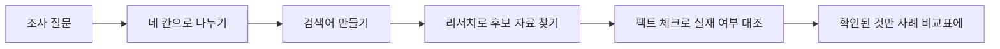
조사가 잘 안 되는 가장 큰 이유는 질문이 뭉뚱그려져 있기 때문입니다. '웨비나 잘하는 법'은 너무 넓습니다. 질문을 네 칸으로 나누면 검색어가 저절로 나옵니다.
<table fit-page-width="true" header-row="true">
<tr>
<td>칸</td>
<td>무엇을 적나</td>
<td>이번 실습에서는</td>
</tr>
<tr>
<td>대상</td>
<td>누구에게</td>
<td>B2B 소프트웨어 웨비나 신청자</td>
</tr>
<tr>
<td>시도</td>
<td>무엇을 했을 때</td>
<td>고객 사례 발표를 넣고, 행사 전 리마인드 메일을 보냈을 때</td>
</tr>
<tr>
<td>비교</td>
<td>무엇과 비교해서</td>
<td>제품 소개만 하는 웨비나</td>
</tr>
<tr>
<td>성과</td>
<td>무엇이 달라지는지</td>
<td>참석률, 웨비나 뒤 도입 상담 요청</td>
</tr>
</table>
**1단계. 질문을 네 칸으로 나누고 사례를 찾아 달라고 합니다.**
```plain text
아래 조사 질문을 대상, 시도, 비교, 성과 네 칸으로 나눠줘. 각 칸마다 검색에 쓸 수 있는 말을 같은 뜻의 다른 표현까지 포함해 한국어와 영어로 만들어줘. 그 검색어로 실제 사례와 조사 자료를 찾아 후보를 최대 6개까지 정리해줘.

조사 질문: B2B 소프트웨어 웨비나에서 고객 사례 발표를 넣고 행사 전 리마인드 메일을 보내면, 제품 소개만 하는 웨비나보다 참석률과 도입 상담 요청이 늘어나는가

후보마다 자료 제목, 발행 기관, 발행일, 원문 주소, 핵심 수치, 그 수치가 원문 어디에 있는지를 적어줘. 원문을 확인하지 못한 수치는 '원문 확인 필요'로 표시하고, 마지막에 오늘 날짜를 검색일로 적어줘.
```
**2단계. 검색이 진행되는 동안 무엇을 찾는지 봅니다.**
어떤 검색어를 쓰는지, 어떤 사이트를 열어 보는지가 보입니다. 이 기록은 나중에 기획서의 근거 부분에 그대로 들어갑니다.
**3단계. 후보 목록을 확인합니다.**
발행 기관, 발행일, 원문 주소가 모두 붙어 있는지 봅니다. 주소가 없는 항목은 다음 실습에서 확인할 수 없습니다. 조사 결과를 세컨드 브레인에 `마케팅-웨비나사례조사-2026-10` 이름의 지식 카드로 저장합니다. 카드는 '결론 / 근거 3개 / 반대 근거 / 다음 행동 / 출처·확인일' 형식으로 줄여 둡니다.
---
## 10. 출처가 진짜인지 확인하기 `팩트 체크`
### 이 기능은 무엇인가 · 팩트 체크
주장과 그 근거를 함께 넣으면 하나씩 원문과 맞춰 보고 판정을 내려 주는 기능입니다. 일반 대화창에 '이거 맞아?'라고 물으면 대체로 '맞습니다'라는 대답이 돌아오지만, 팩트 체크는 항목별로 확인된 것과 확인되지 않은 것을 나누고 왜 그렇게 판정했는지를 함께 적어 줍니다. 표준 모드는 무료 할당량으로 돌아갑니다.
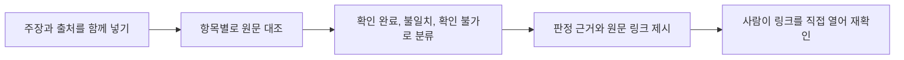
보고서와 기획서에 들어가는 '업계 평균 몇 %' 같은 숫자는 출처를 따라가 보면 없는 경우가 많습니다. AI는 없는 보고서도 그럴듯한 제목과 주소를 붙여 만들어 냅니다. 그래서 눈으로 봐서는 구분되지 않습니다.
**1단계. 팩트 체크 기능을 찾습니다.**
왼쪽 사이드바에서 `더보기`를 누르고 `모든 에이전트`로 들어갑니다. 목록을 아래로 내려 `도구` 구역에서 `팩트 체크`를 찾습니다.
{{IMG:n-14-01-factcheck-entry.png|모든 에이전트 화면입니다. AI 팀, 세컨드 브레인, 오피스 스위트처럼 구역이 나뉘어 있습니다. 팩트 체크는 아래쪽 도구 구역에 있습니다.}}
**2단계. 확인할 주장과 출처를 함께 넣습니다.**
아래 내용을 그대로 붙여 넣습니다. 출처 두 개는 **수업을 위해 일부러 지어낸 가짜**입니다. 팩트 체크가 이것을 걸러내는지 봅니다.
```plain text
B2B 웨비나의 평균 참석률은 신청자의 45% 수준이며, 행사 1시간 전에 리마인드 메일을 보내면 참석률이 두 배로 오른다. 근거 자료는 다음과 같다. McKinsey, "Global Webinar Benchmark 2025", p.12, https://www.mckinsey.com/insights/global-webinar-benchmark-2025-000000. 통계청, "2025 기업 웨비나 활용 실태조사", 2025년 6월 발표.
```
주장과 출처를 한 덩이로 함께 넣는 것이 핵심입니다. 출처만 넣으면 서지사항만 맞춰 보고, 주장만 넣으면 출처를 새로 만들어 옵니다.
**3단계. 대조가 진행되는 동안 무엇을 하는지 봅니다.**
주장 하나하나를 어떤 자료와 맞춰 보는 중인지 표시됩니다. 여러 검색을 동시에 돌리기 때문에 일반 대화보다 시간이 조금 더 걸립니다.
**4단계. 판정 결과를 봅니다.**
- 주장이 두 개로 나뉘어 판정됐는지 봅니다. '평균 참석률 45%'와 '리마인드 메일로 두 배'는 따로 확인해야 하는 주장입니다.
- 두 출처가 어떤 이유로 판정됐는지 봅니다. 주소가 열리는지, 발행 기관의 공식 목록에 그 자료가 있는지 같은 이유가 항목별로 적혀 있어야 합니다.
- 실제로 있는 다른 자료가 근거로 제시됐다면 원문 문장과 링크가 함께 붙어 있는지 봅니다. 원문 문장과 링크가 같이 있어야 확인된 것입니다.
**5단계. 확인 완료로 나온 자료 하나를 직접 열어 봅니다.**
판정이 맞았는지도 사람이 한 번 봐야 합니다. 팩트 체크가 붙여 준 링크를 눌러 원문을 열고 제목, 발행 기관, 날짜, 숫자가 화면에 적힌 것과 같은지 눈으로 확인합니다.
<callout icon="⚠️" color="yellow_bg">
	팩트 체크가 '확인 불가'로 표시한 항목은 가짜라는 뜻이 아니라 찾지 못했다는 뜻입니다. 지우지 말고 '확인 불가'로 남겨 둔 채 발행 기관 홈페이지에서 직접 찾아봅니다.
</callout>
---
## 11. 반대 근거까지 찾기 `딥리서치`
### 이 기능은 무엇인가 · 딥리서치
09번에서 쓴 슈퍼 에이전트는 몇 번 찾아보고 답합니다. 딥리서치는 검색어를 바꿔 가며 수십 번 뒤지고, 찾은 자료를 하나씩 열어 읽은 다음, 출처가 붙은 보고서로 정리합니다. 그래서 시간이 오래 걸립니다. 대신 **'이 주제에서 아직 확실하지 않은 것은 무엇인가'처럼 넓게 훑어야 하는 질문**에 맞습니다.
왼쪽 메뉴 `모든 에이전트` \> `도구` 구역에서 `딥 리서치`를 찾습니다.
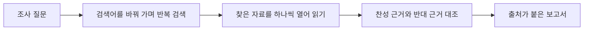
여기서 흔한 실수는 AI가 정리해 준 '잘 되는 방법'을 그대로 믿는 것입니다. 효과가 없었던 사례, 조건이 달라서 결과가 달랐던 사례도 같이 봐야 우리 웨비나에 맞는지 판단할 수 있습니다. 그래서 반대 근거를 같이 찾게 합니다.
**1단계. 딥리서치를 열고 조사 질문을 그대로 적어 줍니다.**
'이 주제'라고만 쓰면 AI는 무엇을 말하는지 모릅니다. 09번의 조사 질문을 프롬프트 안에 그대로 넣습니다.
```plain text
아래 조사 질문에서 아직 근거가 충분하지 않은 부분을 3개 뽑아줘.

조사 질문: B2B 소프트웨어 웨비나에서 고객 사례 발표를 넣고 행사 전 리마인드 메일을 보내면, 제품 소개만 하는 웨비나보다 참석률과 도입 상담 요청이 늘어나는가

각 항목마다 아래를 함께 적어줘.
1. 왜 부족하다고 판단했는지, 근거가 된 문장을 그대로 인용
2. 반대로 효과가 없었거나 조건에 따라 달랐다는 근거가 있는지 찾아서 함께 제시
3. 우리처럼 직원 80명 규모 회사가 참고할 때 주의할 점

모든 항목은 '검증 전 가설'로 표시해줘. 확인하지 못한 것은 추정하지 마라.
```
반대 근거를 함께 찾으라고 시키는 것이 이 실습의 핵심입니다. 이 한 줄이 없으면 AI는 한쪽 근거만 모아 옵니다.
**2단계. 여러 자료를 찾아보는 과정을 봅니다.**
몇 분 걸립니다. 이 동안 창을 닫아도 작업은 계속됩니다.
**3단계. 완성된 보고서에서 항목마다 인용과 반대 근거가 붙었는지 봅니다.**
인용 옆 링크를 눌러 원문에 그 문장이 정말 있는지 한 개라도 직접 확인하십시오. 보고서 끝에 한계를 적은 부분이 있으면 함께 읽습니다. 이 보고서는 확정된 결론이 아니라 기획서에 쓰기 전에 팀에서 한 번 더 확인할 목록입니다.
---
## 12. 사례 비교표 채우기 `AI 시트`
### 이 기능은 무엇인가 · AI 시트
표를 다루는 화면입니다. 엑셀처럼 보이지만 표 위에서 말로 시킬 수 있습니다. '이 열에서 범위를 벗어난 값을 찾아 표시해 줘'처럼 시키면 수식을 몰라도 됩니다.
열 이름과 순서를 그대로 두라고 지정하는 것이 중요합니다. 지정하지 않으면 AI가 열을 마음대로 늘리거나 합쳐서 나중에 팀 양식에 맞추기 어려워집니다.
사례 비교표는 찾은 자료를 한 줄씩 정리한 표입니다. 기획서를 쓸 때도, 보고할 때도 이 표를 그대로 씁니다. 중요한 것은 그 숫자가 원문의 어느 부분에 있었는지까지 적는 것입니다.
**1단계. AI 시트를 열고 빈 사례 비교표를 올립니다.**
`benchmark_table_template.csv`를 올리면 열 이름과 예시 행 하나가 그대로 들어옵니다. 열을 마음대로 늘리거나 줄이지 않습니다.
**2단계. 10번과 11번에서 확인된 자료만 직접 적어서 채워 달라고 합니다.**
'확인된 것만 채워 줘'라고만 하면 AI가 무엇이 확인된 것인지 스스로 정해 버립니다. 내가 확인 완료로 판단한 자료의 제목과 주소를 프롬프트 안에 직접 적어 줍니다.
```plain text
올린 사례 비교표의 열 이름과 순서를 그대로 두고, 예시 행(EXAMPLE-01)은 지우고, 아래 자료만 새 행으로 채워줘.

[10번, 11번에서 내가 확인 완료로 판단한 자료의 제목과 원문 주소를 여기에 붙여 넣기]

각 행마다 아래를 지켜줘.
- 결과 수치는 원문 본문에서 확인한 것만 적어라. 확인하지 못했으면 수치 칸은 비워 두고 '원문 확인 필요'라고 적어라
- 그 수치가 원문의 어느 부분에 있는지 적어라
- human_checked 열에는 모두 '미확인'으로 넣어라
- 10번에서 가짜로 판정된 McKinsey "Global Webinar Benchmark 2025"와 통계청 "2025 기업 웨비나 활용 실태조사"는 절대 넣지 마라
```
**3단계. 완성된 표에서 빈칸과 미확인 표시를 확인합니다.**
빈칸이 있는 것은 잘못이 아닙니다. 빈칸을 그럴듯한 숫자로 채우는 것이 잘못입니다. 가짜 출처 두 개가 들어가지 않았는지 마지막으로 봅니다.
---
## 13. 내 말투로 웨비나 기획서 쓰기 `AI 문서` `세컨드 브레인`
### 이 기능은 무엇인가 · AI 문서와 세컨드 브레인 글쓰기
AI 문서는 글을 쓰는 화면입니다. 워드처럼 생겼지만 문단을 지정해 놓고 '이 부분만 더 짧게'처럼 말로 고칠 수 있습니다.
6.0에서는 여기에 세컨드 브레인이 붙습니다. 세컨드 브레인에 쌓아 둔 내 글과 자료를 근거로 쓰기 때문에, 회사 소개와 회의 결과를 다시 붙여 넣지 않아도 되고 **내 말투가 자연스럽게 묻어납니다.** 대신 두 가지를 꼭 지시합니다. 하나는 자료에서 가져온 문장과 AI가 보탠 문장을 구분하게 하는 것, 다른 하나는 인용에만 집중하다가 글의 흐름이 어색해지지 않게 하는 것입니다.
<callout icon="📖" color="gray_bg">
	**강사 예시 · 세컨드 브레인으로 책 한 권 쓰기**
	쌓아 둔 뉴스레터와 링크드인 글로 주니어에게 건네는 책을 써 봤습니다. 독자, 짧은 에피소드 형식, 존댓말, 평소 말투를 지정하고, '내 글을 인용하는 데만 집중하다 흐름이 어색해지면 안 된다', 'AI가 연결 문장을 보태면 다른 글씨색으로 표시하라'고 덧붙였습니다.
	{{IMG:02-book-prompt.png|책의 독자, 말투, 연결성까지 지정한 실제 세컨드 브레인 집필 요청입니다.}}
	{{IMG:03-essay.png|세컨드 브레인 지식으로 만든 원고입니다. 말투가 자연스러워 거의 고치지 않고 쓸 수 있었습니다.}}
</callout>
**1단계. AI 문서에서 새 문서를 열고 세컨드 브레인 자료를 컨텍스트로 고릅니다.**
04번 업무 맥락 브리프, `writing_samples.md`, 05번 회의록, 09번 조사 지식 카드를 고릅니다.
**2단계. 항목과 말투와 표시 규칙을 지정해서 요청합니다.**
```plain text
선택한 세컨드 브레인 자료를 근거로 11월 웨비나 기획서 초안을 써줘. 읽는 사람은 마케팅 팀장이다. 항목은 아래 순서로 만들어줘.
1. 왜 이 웨비나를 하는가
2. 누구를 대상으로 하는가
3. 60분 프로그램 구성
4. 목표와 무엇으로 잴지
5. 홍보 계획과 일정
6. 필요한 협조와 예산 항목
7. 아직 정하지 않은 것

말투는 writing_samples의 문체를 따라 짧은 문장과 존댓말로 써줘. 자료를 인용하는 데만 집중하다가 글의 흐름이 어색해지지 않게 해줘.
자료에서 가져온 내용 뒤에는 (출처: 자료 이름)을 붙이고, 자료에 없어서 AI가 보탠 연결 문장은 파란색 글씨로 표시해줘.
목표 인원은 회의에서 확정되지 않았으므로 '확인 필요'로 두고, 확인할 수 없는 숫자는 만들지 마라.
```
**3단계. 파란 글씨만 따로 읽어 봅니다.**
AI가 보탠 문장에 새로운 사실이나 숫자가 들어 있으면 지우거나 사람이 확인합니다. 연결을 매끄럽게 하는 문장이라면 그대로 둬도 됩니다.
**4단계. 사람이 정해야 할 부분을 찾아 표시합니다.**
목표 인원, 예산, 경품은 AI가 정할 수 없는 것들입니다. 이 부분에 '확인 필요' 표시가 되어 있는지 보고, 없으면 직접 붙입니다.
<callout icon="💡" color="gray_bg">
	**직무별로 바꿔 쓰기** 같은 프롬프트에서 문서 종류와 항목만 바꾸면 됩니다. HR은 신규 입사자 온보딩 계획서, 영업은 고객 제안서, 운영은 프로세스 개선안, 교육은 과정 운영 계획서로 바꿔 보십시오.
</callout>
---
## 14. 부분만 고치고 사람이 고친 흔적 남기기 `AI 문서`
통째로 다시 만들지 않고 고칠 곳만 지정해서 고치는 것이 결과도 좋고 사용량도 아낍니다. 팀장에게 올라가는 문서는 누가 무엇을 확인했는지가 남아야 하므로 고친 흔적도 문서 안에 적습니다.
**1단계. 고칠 문단만 선택해서 지시합니다.**
13번 기획서에서 '3. 60분 프로그램 구성' 문단만 선택하고 아래처럼 시킵니다.
```plain text
선택한 부분만 고쳐줘. 나머지 문단은 건드리지 마라. 고객 사례 발표 10분을 넣고, 발표 고객사는 '섭외 중'으로 표시해줘. 전체 시간이 60분을 넘지 않게 시간표를 표로 바꿔줘.
```
**2단계. 선택한 부분만 바뀌었는지 봅니다.**
다른 문단이 함께 바뀌었다면 되돌리고 '나머지 문단은 건드리지 마라'가 들어갔는지 다시 봅니다.
**3단계. 문서 끝에 사람이 확인한 기록을 붙입니다.**
```plain text
AI 사용 표시: 이 문서의 초안은 생성형 AI로 작성했고, 아래 항목은 사람이 확인·수정했습니다.
- 확인자:
- 확인일:
- 수정한 항목과 이유:
- 아직 확인하지 못한 항목:
이 문서는 팀 내부 검토용 초안입니다.
```
**4단계. 완성된 기획서를 세컨드 브레인에 저장합니다.**
`2026-10_11월웨비나_기획서_v1` 로 저장합니다. 15번 랜딩페이지, 17번 초대 메일, 21번 보고 슬라이드가 모두 이 문서를 근거로 씁니다.
---
## 15. 브랜드 가이드로 디자인 시스템 만들고 랜딩페이지 만들기 `디자인`
### 이 기능은 무엇인가 · 디자인과 디자인 시스템
AI 이미지가 한 장의 그림을 만든다면, 디자인은 글자와 이미지와 배경이 따로 살아 있는 **편집 가능한 디자인물**을 만듭니다. 랜딩페이지, 카드뉴스, 포스터, 앱 화면처럼 레이아웃이 중요한 결과물에 씁니다.
6.0에서 핵심은 **디자인 시스템**입니다. 브랜드 가이드나 기존 디자인 파일을 주면 로고, 색, 글꼴, 여백 같은 특징을 읽어 하나의 시스템으로 정리하고, 그다음부터는 무엇을 만들든 그 규칙을 그대로 씁니다. 매번 '우리 색은 파란색이고 글꼴은...'을 설명하지 않아도 됩니다.
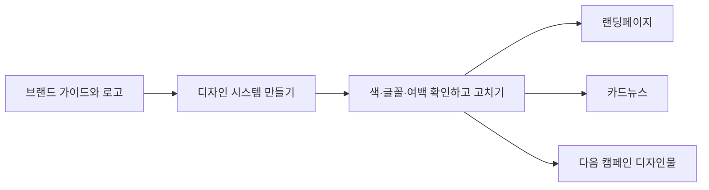
<callout icon="🎨" color="gray_bg">
	**강사 예시 · 브랜드 가이드로 웨비나 페이지 만들기**
	피그마에 정리된 브랜드 가이드를 주고 디자인 시스템을 만든 뒤, 기존 웨비나 페이지 코드를 주면서 다시 디자인해 달라고 했습니다. 폰트와 주요 색상을 잘 잡아냈고, 그 시스템 그대로 카드뉴스까지 만들 수 있었습니다.
	{{IMG:07-design.png|브랜드 디자인 시스템을 적용해 만든 웨비나 홍보 페이지입니다.}}
</callout>
**1단계. 디자인을 열고 새 디자인 시스템을 만듭니다.**
왼쪽 메뉴의 디자인으로 들어가 입력창 아래 `디자인 시스템 없음`을 누르고 새 디자인 시스템 만들기를 고릅니다.
**2단계. 브랜드 가이드와 로고를 올립니다.**
`brand_guide.md`와 `moawork_logo.svg`를 올리고 아래처럼 요청합니다.
```plain text
첨부한 브랜드 가이드와 로고로 모아워크 디자인 시스템을 만들어줘. 가이드에 적힌 색상 코드, 글꼴, 여백, 모서리, 아이콘 규칙, 말투 규칙을 그대로 반영하고, 가이드에 없는 규칙은 임의로 만들지 말고 '확인 필요'로 표시해줘.
```
**3단계. 만들어진 디자인 시스템을 가이드와 대조합니다.**
- 색상: 모아 블루 #1F4FD8, 선라이즈 #FFB547, 클라우드 #F6F7FB, 잉크 #1A1D29가 그대로 들어갔는지
- 글꼴: 제목 Pretendard Bold, 본문 Pretendard Regular인지
- 금지 규칙: 그라데이션, 3D 아이콘, 과장 표현 금지가 들어갔는지
다르게 읽힌 것이 있으면 그 부분만 고쳐 달라고 합니다.
**4단계. 이 디자인 시스템으로 웨비나 랜딩페이지를 만듭니다.**
```plain text
방금 만든 모아워크 디자인 시스템을 적용해서 11월 웨비나 신청 랜딩페이지를 만들어줘. 내용은 세컨드 브레인의 '11월웨비나_기획서_v1'을 근거로 한다.
1. 첫 화면: 웨비나 제목, 날짜와 시간, 신청 버튼
2. 이런 분께 추천합니다 (3가지)
3. 60분 프로그램 순서
4. 고객 사례 발표 소개 (발표 고객사는 '섭외 중'으로 표시)
5. 자주 묻는 질문 3개
6. 마지막 신청 버튼

확정되지 않은 숫자, 목표 인원, 경품은 넣지 마라. 브랜드 가이드의 금지 표현을 지켜라.
```
**5단계. 결과를 보고 고칠 곳만 댓글로 요청합니다.**
날짜와 시간이 기획서와 같은지, 포인트 색이 한 화면에 한 곳만 쓰였는지, '업계 최초' 같은 표현이 없는지 봅니다. 마음에 안 드는 부분은 새로 만들지 말고 그 요소만 골라 댓글로 고쳐 달라고 합니다.
---
## 16. 같은 디자인 시스템으로 카드뉴스 만들기 `디자인` `AI 이미지`
디자인 시스템을 한 번 만들어 두면 다음 결과물은 짧은 요청으로 끝납니다. 카드뉴스를 부탁하면 필요한 이미지까지 생성해서 넣어 줍니다.
**1단계. 같은 디자인 시스템을 고른 상태에서 카드뉴스를 요청합니다.**
```plain text
모아워크 디자인 시스템으로 11월 웨비나 홍보용 SNS 카드뉴스 5컷을 만들어줘. 1:1 비율.
1컷: 질문으로 시작하는 표지 ('회의 끝나고 5분 뒤, 누가 뭘 하기로 했는지 기억하시나요?')
2~4컷: 웨비나에서 얻어 갈 것 1개씩
5컷: 날짜, 시간, 신청 방법

삽입 이미지는 기본 화질 GPT Image로 생성해 넣어줘. 사람 얼굴이 정면으로 크게 나오지 않게 해줘.
모든 글자는 30pt 이상, 30~100pt 사이에서 크기 차이를 줘. 로고는 5컷에만 넣어줘.
```
**2단계. 다섯 컷의 색, 글꼴, 여백이 같은지 봅니다.**
15번 랜딩페이지와 나란히 놓고 같은 브랜드로 보이는지 봅니다. 글자가 이미지 안에 그려져 깨진 컷이 있으면 그 컷만 고쳐 달라고 합니다.
{{IMG:07b-cardnews.png|강사 예시: 디자인 시스템을 만들어 두고 카드뉴스를 요청하면 이미지까지 생성해서 이렇게 만들어 줍니다.}}
**3단계. 이미지 한 장만 바꾸고 싶을 때는 AI 이미지에서 고칩니다.**
마음에 안 드는 이미지를 새로 만들면 사용량이 빨리 줄고 결과도 매번 달라집니다. 이미지를 AI 이미지로 가져가 고칠 부분만 지시합니다.
```plain text
이 이미지를 바탕으로 아래만 고쳐줘. 전체를 새로 만들지 마라.
- 배경을 더 밝게
- 노트북 화면 속 글자는 지우기
- 색감은 파란색 계열 유지
```
기본 화질은 크레딧 무관 혜택으로 돌아가지만 고화질과 큰 크기는 크레딧을 씁니다. 초안은 기본 화질로 다듬고, 광고에 실제로 쓸 최종 한 장만 고화질로 뽑습니다.
**4단계. 내려받습니다.**
다운로드를 누르면 zip 파일로 받습니다. 컷마다 이미지로 받고 싶으면 채팅창에서 이미지로 달라고 요청합니다.
---
## 17. 초대 메일 초안 만들기 `GenMail`
### 이 기능은 무엇인가 · GenMail
메일함을 연결해 두면 받은 메일을 정리하고 답장 초안을 만들어 주는 기능입니다. 연결하면 'Email Brain' 화면에 내 역할, 쓰는 언어, 메일 쓰는 방식이 정리됩니다. AI가 정리한 내용이므로 사실과 맞는지 한 번 확인하고 씁니다.
여기서 중요한 점이 하나 있습니다. **GenMail은 세컨드 브레인과 이어져 있습니다.** 그래서 14번 기획서와 15번 랜딩페이지 내용을 다시 붙여 넣지 않아도 '그 기획서로 초대 메일 써 줘'처럼 불러다 쓸 수 있습니다. 이것이 앞에서 세컨드 브레인에 자료를 차곡차곡 넣어 온 이유입니다.
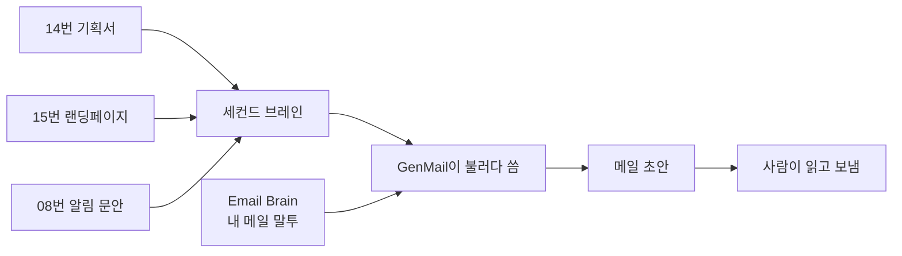
연결하는 메일함은 개인 메일 계정으로만 하십시오. 회사 메일함은 고객 정보가 오가는 통로이므로 보안 담당의 승인 없이 연결하지 않습니다. 오늘 실습은 초안까지만 만들고 보내지 않습니다.
**1단계. GenMail을 열고 Email Brain을 확인합니다.**
{{IMG:16-email-brain.png|강사 예시: 받은편지함에서 파악한 역할과 메일 쓰는 방식이 정리된 Email Brain 화면입니다. 틀린 내용이 있으면 여기서 먼저 고칩니다.}}
**2단계. 초대 메일을 만들어 달라고 합니다.**
```plain text
세컨드 브레인의 '11월웨비나_기획서_v1'과 15번에서 만든 랜딩페이지 내용을 참고해서 고객에게 보낼 1차 초대 메일 초안을 써줘.
- 제목 후보 3개
- 본문: 누구를 위한 웨비나인지, 무엇을 얻어 가는지, 날짜와 시간, 신청 방법
- 핵심 요약 3줄
- 신청 버튼 문구 1개

날짜, 시간, 링크는 기획서와 한 글자씩 맞춰 보고, 확정되지 않은 경품이나 목표 인원은 넣지 마라. 내 평소 메일 말투를 따르되 과장 표현은 쓰지 마라. 보내지 말고 초안으로만 둬.
```
**3단계. 만들어진 초안을 읽고 고칩니다.**
날짜와 시간이 기획서와 같은지, 섭외 중인 고객사 이름이 확정된 것처럼 들어가지 않았는지, 단정하는 표현이 없는지 봅니다.
{{IMG:17-email-draft.png|강사 예시: 웹페이지 주소를 주고 웨비나 안내 메일을 써 달라고 한 결과입니다. 웹에서 정보를 가져오면서 평소 말투도 반영합니다.}}
**4단계. 보내지 않고 초안으로 둡니다.**
실습에서는 여기서 멈춥니다. 실제 업무에서도 책임자가 읽은 뒤 사람이 보냅니다.
---
## 18. 신청자 데이터 오류 먼저 찾기 `AI 시트`
웨비나가 끝났습니다. 이제 신청자 명단으로 결과를 봅니다. 데이터 분석에서 가장 많이 나오는 사고는 오류가 있는 자료를 그대로 분석하는 것입니다. 시트는 값이 이상해도 계산을 해 버립니다. 그래서 분석을 시작하기 전에 자료부터 점검합니다.
**이번에 쓰는 파일**
`webinar_registrants.csv` 가상 신청자 48행입니다. 신청자 번호, 회사 규모, 직무, 유입 채널, 신청일, 참석 여부, 시청시간(분), 만족도(1\~5), 도입 관심, 메모가 있습니다. 오류와 개인정보가 일부러 섞여 있습니다.
**1단계. AI 시트를 열고 자료를 올린 뒤 크기부터 확인합니다.**
{{IMG:04-02-ai-sheets-entry.png|왼쪽 메뉴에서 AI 시트를 누릅니다. 엑셀처럼 보이지만 표 위에서 말로 시킬 수 있습니다.}}
행이 48개인지, 열 이름이 무엇인지 먼저 봅니다. 올리다가 잘리는 경우가 있어서 행 수를 꼭 확인합니다.
**2단계. 무엇을 점검할지 지정해서 요청합니다.**
```plain text
올린 자료를 고치지 말고 점검만 해줘. 웨비나는 2026-11-19에 60분 동안 열렸다. 아래 항목을 각각 확인해서 문제가 있는 행 번호와 이유를 표로 정리해줘.
1. 신청자 번호가 중복된 행
2. 값이 비어 있는 칸
3. 신청일이 웨비나 날짜보다 늦은 행
4. 참석(Y)인데 시청시간이 1~60분을 벗어난 행
5. 불참(N)인데 시청시간이나 만족도가 있는 행
6. 만족도가 1~5를 벗어난 행
7. 메모 칸에 전화번호나 메일 주소 같은 개인정보가 들어 있는 행
8. 유입 채널별 행 수

값을 고치거나 지우지 마라. 개인정보는 결과에 옮겨 적지 말고 '개인정보 있음'으로만 표시해줘. 어떤 규칙으로 문제라고 판단했는지 함께 적어줘.
```
점검 항목을 번호로 지정하면 빠뜨리지 않습니다. '고치지 마라'를 반드시 넣습니다.
**3단계. 문제 목록을 확인합니다.**
- W011이 두 번 나오는 것, W033의 시청시간 95분, W037처럼 불참인데 시청시간이 있는 행이 잡혔는지 봅니다.
- 메모 칸에 전화번호가 들어 있는 행이 '개인정보 있음'으로만 표시되고 번호가 결과에 옮겨지지 않았는지 봅니다.
- 불참자의 만족도·도입 관심 칸은 원래 비어 있어야 하는 칸입니다. AI가 이것까지 결측으로 잡았다면 '불참자의 빈칸은 정상'이라는 규칙을 더해 다시 점검하게 합니다.
여기서 무엇을 뺄지는 사람이 정합니다.
---
## 19. 지표 정의 고르고 계산하고 검산하기 `AI 시트`
AI에게 "채널별로 분석해 줘"라고만 하면 지표를 하나 골라서 결과를 냅니다. 그 지표가 왜 맞는지는 설명하지 않습니다. 순서를 바꿔야 합니다. 먼저 분석할 행을 정하고, 지표 후보를 늘어놓게 하고, 사람이 고른 뒤에 계산합니다.
**1단계. 분석에 쓸 행을 먼저 정합니다.**
```plain text
분석용 사본을 따로 만들고 아래 조건을 모두 만족하는 행만 남겨줘. 원본은 그대로 둬.
1. 중복된 신청자 번호는 첫 번째 행만 사용
2. 유입 채널이 비어 있지 않은 행
3. 신청일이 2026-11-19와 같거나 빠른 행
4. 참석(Y)이면 시청시간 1~60분, 불참(N)이면 시청시간 0인 행
5. 만족도가 비어 있거나 1~5인 행
6. 메모 칸의 개인정보는 '가림'으로 바꾸되 행은 빼지 마라

몇 행이 남았는지, 어떤 행이 왜 빠졌는지 목록으로 알려줘.
```
**42행이 남아야 합니다.** 이 숫자를 적어 두십시오. 3단계와 4단계에서 숫자가 맞는지 확인하는 데 씁니다.
**2단계. 지표 후보를 비교하게 합니다.**
```plain text
방금 만든 분석용 사본으로 유입 채널(뉴스레터, 링크드인, 영업 추천, 검색 광고) 중 어디가 효과가 좋았는지 보려고 한다. '효과가 좋았다'를 잴 수 있는 지표 후보 3개를 표로 비교해줘. 각 지표마다 아래를 적어줘.
- 계산식
- 이 지표가 말해 주는 것과 말해 주지 못하는 것
- 이 자료에서 채널별 행 수를 고려했을 때의 한계

하나로 확정하지 마라. 내가 고른 다음에 계산해라.
```
참석률, 참석자 중 도입 관심 비율, 평균 시청시간 같은 후보가 나옵니다. 어떤 지표를 쓸지는 이 웨비나의 목적에 따라 사람이 정합니다.
**3단계. 고른 지표 하나를 지정해 계산합니다.**
```plain text
위 비교표에서 내가 고른 지표는 [지표 이름]이다. 이 지표로만 채널별 결과를 계산해줘. 채널마다 사용한 행 수, 분자와 분모, 결과 값을 함께 적어줘. 해석이나 추천은 하지 마라.
```
채널별 신청 수를 모두 더하면 42가 되어야 합니다. 다르면 결과를 그대로 쓰지 말고 다음 단계에서 다시 계산합니다.
**4단계. 결과를 독립적으로 다시 계산합니다.**
```plain text
방금 낸 결과를 독립적으로 다시 계산해서 검산표를 만들어줘.
- 실제로 사용한 행 수
- 채널별 행 수
- 채널별 분자와 분모
- 제외한 행과 제외 이유
- 사용한 계산식

앞의 결과와 숫자가 다르면 어디서 달라졌는지 알려줘.
```
<callout icon="⚠️" color="yellow_bg">
	어떤 채널은 신청자가 한 자릿수밖에 안 됩니다. 몇 명만 더 오거나 덜 와도 비율이 크게 바뀌므로, 행 수가 적은 채널의 비율을 '가장 효과 좋은 채널'이라는 결론으로 바로 쓰지 않습니다.
</callout>
---
## 20. 그래프 만들고 결과 내보내기 `AI 시트`
보고에서 문제가 되는 그래프는 대부분 축이 잘려 있거나, 몇 명을 가지고 그린 것인지 안 적혀 있는 그래프입니다. 그래프를 만들 때 함께 적을 것을 미리 지정합니다.
**1단계. 조건을 정해서 그래프를 요청합니다.**
```plain text
19번에서 고른 지표로 유입 채널별 막대그래프를 만들어줘. 아래를 지켜줘.
- 세로축은 지표 이름과 단위를 표시
- 세로축을 0부터 시작하고 중간을 자르지 마라
- 막대 위에 채널별 분석 행 수(n)를 함께 표시
- 그래프 아래에 제외한 행 수와 제외 규칙을 주석으로 표시
```
축이 잘리지 않았는지, 몇 명인지가 그래프 안에 있는지 봅니다. 이 두 가지만 지켜도 오해를 크게 줄입니다.
**2단계. 점검 기록과 결과를 함께 내보냅니다.**
그래프만 내보내지 않습니다. 점검 기록, 지표 비교표, 계산식, 검산표를 같이 내보내야 나중에 설명할 수 있습니다. 이 시트의 링크를 복사해 둡니다. 21번에서 슬라이드에 그대로 넘깁니다.
---
## 21. 결과 보고 슬라이드 만들기 `AI 슬라이드` `Skills`
### 이 기능은 무엇인가 · AI 슬라이드와 스킬
발표자료를 만드는 화면입니다. 장별 구성을 정해 주면 그 순서대로 만들어 주고, 다 만든 뒤 PPT나 PDF로 내려받을 수 있습니다. 6.0에서는 PPT로 내려받아도 레이아웃이 잘 깨지지 않습니다.
이번 실습은 앞의 것들과 세 가지가 다릅니다.
1. **세컨드 브레인 자료를 슬라이드가 직접 찾아 씁니다.** 기획서와 회의록을 다시 붙여 넣지 않습니다.
2. **20번 분석 결과 링크를 그대로 던져 줍니다.** 숫자를 손으로 옮겨 적지 않으니 옮기다 틀릴 일이 없습니다.
3. **미리 만들어진 Skill을 붙여서 씁니다.** Skill은 템플릿과 업무 방식을 정해 둔 지시서라서 장 구성과 톤이 매번 같아집니다.
<callout icon="🖥️" color="gray_bg">
	**강사 예시 · 세컨드 브레인으로 회사소개서 만들기**
	스킬을 고르고 '세컨드 브레인 내용을 바탕으로 회사소개서를 10장 정도 만들어 달라'고만 했습니다. 왼쪽에서 AI가 예전에 나눈 대화와 자료를 찾아 쓰는 과정이 보이고, 오른쪽에 슬라이드가 만들어집니다.
	{{IMG:04-slides.png|세컨드 브레인 기록을 찾아 회사소개서를 만드는 AI 슬라이드 화면입니다.}}
	{{IMG:13-skills.png|마케팅 등 목적별로 고를 수 있는 AI 슬라이드 스킬 화면입니다.}}
</callout>
**1단계. 스킬이 붙은 AI 슬라이드 화면을 엽니다.**
아래 주소로 들어가면 한국식 보고서 형식이 잡혀 있는 스킬이 붙은 상태로 열립니다. 입력창 위에 스킬 이름이 표시되는지 확인합니다.
```plain text
https://www.genspark.ai/ai_slides?skill=ebefe361c4de4d2db33fce87dbd8c528
```
**2단계. 모드를 표준으로 둡니다.**
{{IMG:n-20-02-ultra.png|Standard는 '무료 할당량 사용, 일상적인 덱을 위한 빠르고 경제적인 모드', Ultra는 '고품질 슬라이드에 최적의 선택 · 100 크레딧/페이지부터'라고 적혀 있습니다. 5장을 Ultra로 만들면 500 크레딧이 넘습니다. 오늘은 표준으로 만듭니다.}}
실무에서는 팀 안에서 돌려 보는 자료는 표준으로 만들고, 밖으로 나가는 최종본만 Ultra로 한 번 만듭니다. 강사가 같은 프롬프트를 Ultra로 한 번 돌려 차이를 보여 드립니다.
**3단계. 세컨드 브레인 자료와 분석 결과 링크를 함께 넣습니다.**
```plain text
세컨드 브레인의 '11월웨비나_기획서_v1'과 킥오프 회의록, 아래 분석 결과를 근거로 마케팅 팀장 보고용 발표자료를 5장으로 만들어줘.
분석 결과: [20번에서 복사한 AI 시트 링크]
브랜드 기준: 세컨드 브레인의 brand_guide의 색과 글꼴

장별 구성은 아래로 해줘.
1장 웨비나 결과 한눈에 (신청, 참석, 참석률)
2장 유입 채널별 결과
3장 참석자 반응 (만족도, 도입 관심)
4장 다음 웨비나에서 바꿔 볼 것
5장 확인이 필요한 항목과 결정이 필요한 것

아래를 지켜줘.
- 한 장에 메시지 하나, 제목만 읽어도 결론이 이어지게
- 출처가 없는 숫자는 넣지 마라
- 각 장 아래에 근거를 한 줄로 표시
- 행 수가 적은 채널의 결과는 단정하지 마라
- 마지막 장은 사람이 확인해야 할 항목
```
**4단계. 세컨드 브레인에서 무엇을 찾아 쓰는지 봅니다.**
왼쪽에 AI가 어떤 자료를 찾아 읽는지 나옵니다. 기획서와 회의록을 제대로 찾았는지 봅니다.
**5단계. 완성된 5장을 봅니다.**
1장의 숫자가 19번의 42행 기준 결과와 같은지 먼저 봅니다. 분석에서 뺀 6행을 넣고 계산한 숫자가 보이면 링크의 어느 탭을 읽었는지 확인하고 고칩니다. 앞뒤 순서가 자연스러운지, 같은 내용이 두 장에 반복되지 않는지도 봅니다.
**6단계. PPT로 내려받아 확인합니다.**
회의에서 고쳐야 한다면 PPT로 받습니다. 파워포인트에서 열어 글자가 편집되는지, 깨지지 않는지 확인합니다.
---
## 22. 반복 업무를 Skill로 저장하고 새 파일로 다시 돌리기 `Skills`
### 이 기능은 무엇인가 · Skills
자주 하는 일의 순서를 글로 적어 저장해 두는 곳입니다. 저장해 두면 다음부터는 긴 프롬프트를 다시 쓰지 않고 지시서 이름만 부르면 됩니다. 파일만 바꿔 넣으면 같은 순서가 그대로 돌아갑니다. 21번의 슬라이드 스킬처럼 남이 만든 것을 쓸 수도 있고, 내 일에 맞게 직접 만들 수도 있습니다.
지시서에는 무엇을 넣어도 되는지, 무엇을 넣으면 안 되는지, 어떤 경우에 멈춰야 하는지를 함께 적습니다. 이것이 있어야 다른 사람이 이어받아 써도 같은 선을 지킵니다.
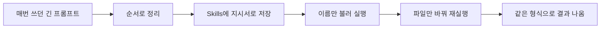
웨비나는 분기마다 열리고, 사례 조사와 신청자 데이터 점검은 매번 같은 순서로 반복됩니다. 오늘 한 순서를 저장해 두면 다음 웨비나에서는 파일만 바꿔 넣으면 됩니다. 이것이 오늘 과정에서 가장 오래 남는 결과물입니다.
**0단계. Skills 목록을 열어 봅니다.**
{{IMG:14-general-skills.png|스킬 페이지에는 슬라이드뿐 아니라 문서, 리서치, 데이터, 영상 제작 등 반복 업무에 쓰는 일반 스킬도 있습니다. 역할과 결과물 종류별로 찾아볼 수 있습니다.}}
**1단계. 사례 조사 지시서를 만듭니다.**
새로 만들기를 누르고 `benchmark_research_skill.md`의 내용을 붙여 넣습니다. 넣으면 안 되는 것과 멈춰야 하는 조건이 들어 있는지 확인합니다.
**2단계. 다른 조사 질문으로 실행해 봅니다.**
입력창에서 지시서 이름을 부르거나 목록에서 눌러 실행합니다. 실행 화면에 지시서 이름이 표시되는지 먼저 확인합니다. 예를 들어 '신규 입사자 온보딩에서 선배 버디 제도가 3개월 내 퇴사를 줄이는가'처럼 주제를 바꿔도 같은 형식의 사례 비교표가 나오면 지시서가 잘 만들어진 것입니다.
**3단계. 신청자 데이터 점검 지시서를 만듭니다.**
`registrant_data_qc_skill.md`의 내용을 붙여 넣습니다. 원자료를 고치지 않는다는 규칙과 개인정보를 옮겨 적지 않는다는 규칙이 들어 있는지 확인합니다.
**4단계. 18번 자료로 실행합니다.**
`webinar_registrants.csv`로 18번과 같은 점검이 나오는지 봅니다.
**5단계. 처음 보는 새 자료로 실행합니다.**
`webinar_registrants_retest.csv`를 넣습니다. 2027년 2월 10일 웨비나의 신청자 30행이고, 여기에도 오류와 개인정보가 섞여 있습니다. 행사일과 길이(60분)를 물어보면 알려 줍니다.
**6단계. 두 번의 결과를 비교합니다.**
같은 항목을 같은 형식으로 점검했는지 봅니다. 형식이 달라지면 지시서의 출력 형식을 더 구체적으로 적습니다.
---
## 23. AI 팀에게 다음 90일 계획 토론 맡기기 `GenTeam`
### 이 기능은 무엇인가 · GenTeam
AI 하나와 대화하는 대신, 역할이 다른 AI 여럿을 한 대화방에 불러 모아 서로 따지게 하는 기능입니다. 사람 동료를 초대해 같은 방에서 볼 수도 있습니다.
글이나 디자인은 원하는 결과물이 비교적 분명합니다. 하지만 '다음 분기에 무엇을 해야 할까'처럼 방향부터 정해야 하는 일은 혼자 정하기 어렵고, AI 한 대에게 검토를 시켜도 대체로 좋은 말만 돌아옵니다. 역할을 나누고 그중 하나를 '반대 의견 담당'으로 두면 그제서야 약점이 나옵니다. 그리고 6.0에서는 이 토론이 **세컨드 브레인에 쌓인 오늘의 자료 전부를 근거로** 이루어집니다.
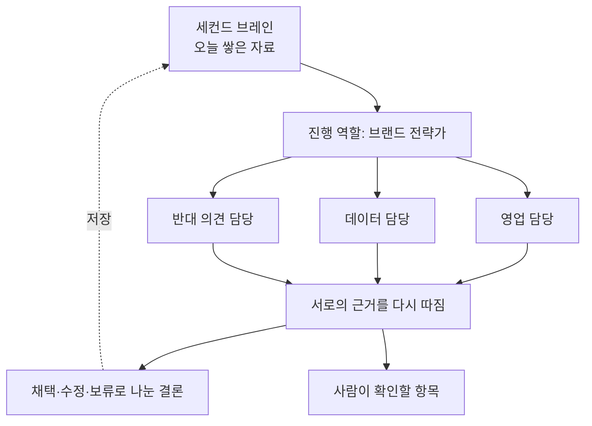
<callout icon="🤝" color="gray_bg">
	**강사 예시 · AI 팀원들이 서로의 제안을 고치는 장면**
	세컨드 브레인 지식을 바탕으로 90일 계획을 짜 달라고 하면서 브랜드 전략가에게 권한을 주고 필요한 에이전트를 마음대로 부르게 했습니다. 브랜드 전략가가 다른 에이전트의 판매 방식 제안을 다시 검토하면서 '타깃이 비슷한 형식을 실제로 사 본 적이 있는지, 가격만 보고 판단한 건 아닌지'를 짚었습니다. AI끼리도 '그 근거로는 부족하다'고 다시 따지는 것입니다.
	{{IMG:08-genteam.png|젠팀에서 브랜드 전략가와 다른 AI 에이전트들이 계획의 근거를 검토하는 실제 대화입니다.}}
</callout>
**1단계. GenTeam에서 새 방을 만들고 에이전트를 초대합니다.**
{{IMG:n-genteam-01-new.png|새 방을 만들고 역할이 다른 AI를 불러 모읍니다.}}
**2단계. 진행 역할에 권한을 주고 토론을 시킵니다.**
```plain text
세컨드 브레인의 모아워크 자료(회사 소개, 웨비나 기획서, 킥오프 회의록, 신청자 분석 결과, 사례 비교표)를 바탕으로 다음 90일 동안의 고객 웨비나·콘텐츠 계획을 세워줘.

브랜드 전략가가 진행을 맡고, 필요하면 다른 에이전트를 직접 불러와도 된다. 최소한 아래 역할은 참여시켜라.
- 영업 담당: 이 계획이 도입 상담으로 이어질 수 있는지
- 데이터 담당: 근거로 쓴 숫자가 충분한지, 행 수가 적은 결과를 과하게 믿고 있지 않은지
- 반대 의견 담당: 이 계획이 실패할 수 있는 이유

서로의 의견에 근거가 부족하면 그렇다고 지적해라. 마지막에 채택·수정·보류로 나눈 결론, 월별 목표, 사람이 최종 확인해야 할 항목을 정리해줘.
```
역할마다 무엇을 볼지 지정하는 것이 중요합니다. 그냥 검토하라고 하면 여러 역할이 비슷한 말을 합니다.
**3단계. 주고받는 과정을 봅니다.**
한쪽이 제시한 근거를 다른 쪽이 다시 따지는 부분을 봅니다. 특히 데이터 담당이 19번의 '행 수가 적은 채널' 문제를 짚는지 봅니다. 이 대목에서 우리가 놓친 것이 나옵니다.
**4단계. 결론과 사람이 확인할 항목을 정리하고 세컨드 브레인에 저장합니다.**
합의된 결론보다 '사람이 확인해야 할 항목'이 더 중요합니다. 이 목록을 그대로 다음 회의 안건으로 씁니다. 결과 문서를 세컨드 브레인에 저장하면, 다음 웨비나는 이 계획에서 출발합니다. 01번에서 본 '넣기 → 만들기 → 검토하기 → 실행하기'가 한 바퀴 돈 것입니다.
---
## 우리 팀에 적용할 계획 쓰기
아래 표를 채웁니다. 오늘 배운 것 중에서 다음 주에 실제로 써 볼 것 하나만 고릅니다.
<table fit-page-width="true" header-row="true">
<colgroup>
<col>
<col width="422">
</colgroup>
<tr>
<td>항목</td>
<td>내가 쓸 내용</td>
</tr>
<tr>
<td>다음 주에 써 볼 실습 번호</td>
<td></td>
</tr>
<tr>
<td>어떤 업무에 쓸 것인가</td>
<td></td>
</tr>
<tr>
<td>그 업무에 지금 몇 시간 걸리는가</td>
<td></td>
</tr>
<tr>
<td>세컨드 브레인에 넣을 수 있는 자료는 무엇인가</td>
<td></td>
</tr>
<tr>
<td>절대 올리면 안 되는 자료는 무엇인가</td>
<td></td>
</tr>
<tr>
<td>표준으로 할 것과 Ultra로 할 것</td>
<td></td>
</tr>
<tr>
<td>결과를 누가 확인할 것인가</td>
<td></td>
</tr>
<tr>
<td>팀에 공유해야 할 규칙</td>
<td></td>
</tr>
</table>
## 강의 교시와 실습 번호
<table fit-page-width="true" header-row="true">
<tr>
<td>교시</td>
<td>주제</td>
<td>이 페이지의 실습</td>
</tr>
<tr>
<td>1</td>
<td>오리엔테이션 + Workspace 6.0 지도</td>
<td>01, 02, 03, 04</td>
</tr>
<tr>
<td>2</td>
<td>검색·Deep Research + Second Brain</td>
<td>09, 10, 11, 12</td>
</tr>
<tr>
<td>3</td>
<td>AI 이미지 + 디자인 시스템</td>
<td>15, 16</td>
</tr>
<tr>
<td>4</td>
<td>AI Doc + Second Brain 글쓰기</td>
<td>05, 06, 13, 14</td>
</tr>
<tr>
<td>5</td>
<td>AI Slide + Skill 재사용</td>
<td>21, 22</td>
</tr>
<tr>
<td>6</td>
<td>AI 영상 + 제작 Skill</td>
<td>파트 3 영상 실습 (16번 카드뉴스를 15초 홍보 영상으로 바꿔 보기)</td>
</tr>
<tr>
<td>7</td>
<td>AI 시트·대시보드 + GenTeam 검토</td>
<td>07, 18, 19, 20, 23</td>
</tr>
<tr>
<td>8</td>
<td>GenMail·워크플로우 + 종합 프로젝트</td>
<td>08, 17, 우리 팀 적용 계획</td>
</tr>
</table>
## 바로가기
<table fit-page-width="true" header-row="true">
<tr>
<td>기능</td>
<td>주소</td>
<td>쓰는 실습</td>
</tr>
<tr>
<td>젠스파크 홈 (슈퍼 에이전트)</td>
<td>[https://www.genspark.ai](https://www.genspark.ai)</td>
<td>01, 02, 09</td>
</tr>
<tr>
<td>AI 채팅</td>
<td>[https://www.genspark.ai/agents?type=ai_chat](https://www.genspark.ai/agents?type=ai_chat)</td>
<td>01</td>
</tr>
<tr>
<td>요금제와 무료 할당량 안내</td>
<td>[https://www.genspark.ai/helpcenter/membership-plans](https://www.genspark.ai/helpcenter/membership-plans)</td>
<td>02</td>
</tr>
<tr>
<td>세컨드 브레인</td>
<td>[https://www.genspark.ai/second-brain](https://www.genspark.ai/second-brain)</td>
<td>03, 04, 06</td>
</tr>
<tr>
<td>AI 회의록</td>
<td>홈 화면 왼쪽 메뉴에서 'AI 회의록'</td>
<td>05</td>
</tr>
<tr>
<td>대시보드 & CRM</td>
<td>홈 화면 왼쪽 메뉴에서 '대시보드 & CRM'</td>
<td>07, 08</td>
</tr>
<tr>
<td>팩트 체크, 딥리서치</td>
<td>왼쪽 메뉴 '더보기' \> '모든 에이전트' \> '도구'</td>
<td>10, 11</td>
</tr>
<tr>
<td>AI 시트</td>
<td>홈 화면 왼쪽 메뉴에서 'AI 시트'</td>
<td>12, 18, 19, 20</td>
</tr>
<tr>
<td>AI 문서</td>
<td>홈 화면 왼쪽 메뉴에서 'AI 문서'</td>
<td>13, 14</td>
</tr>
<tr>
<td>디자인</td>
<td>[https://www.genspark.ai/agents?type=design](https://www.genspark.ai/agents?type=design)</td>
<td>15, 16</td>
</tr>
<tr>
<td>AI 이미지</td>
<td>홈 화면 왼쪽 메뉴에서 'AI 이미지'</td>
<td>16</td>
</tr>
<tr>
<td>GenMail</td>
<td>[https://www.genspark.ai/genmail](https://www.genspark.ai/genmail)</td>
<td>17</td>
</tr>
<tr>
<td>AI 슬라이드 (스킬 적용)</td>
<td>[https://www.genspark.ai/ai_slides?skill=ebefe361c4de4d2db33fce87dbd8c528](https://www.genspark.ai/ai_slides?skill=ebefe361c4de4d2db33fce87dbd8c528)</td>
<td>21</td>
</tr>
<tr>
<td>Skills</td>
<td>[https://www.genspark.ai/skills](https://www.genspark.ai/skills)</td>
<td>22</td>
</tr>
<tr>
<td>GenTeam</td>
<td>[https://www.genspark.ai/genteam](https://www.genspark.ai/genteam)</td>
<td>23</td>
</tr>
</table>
